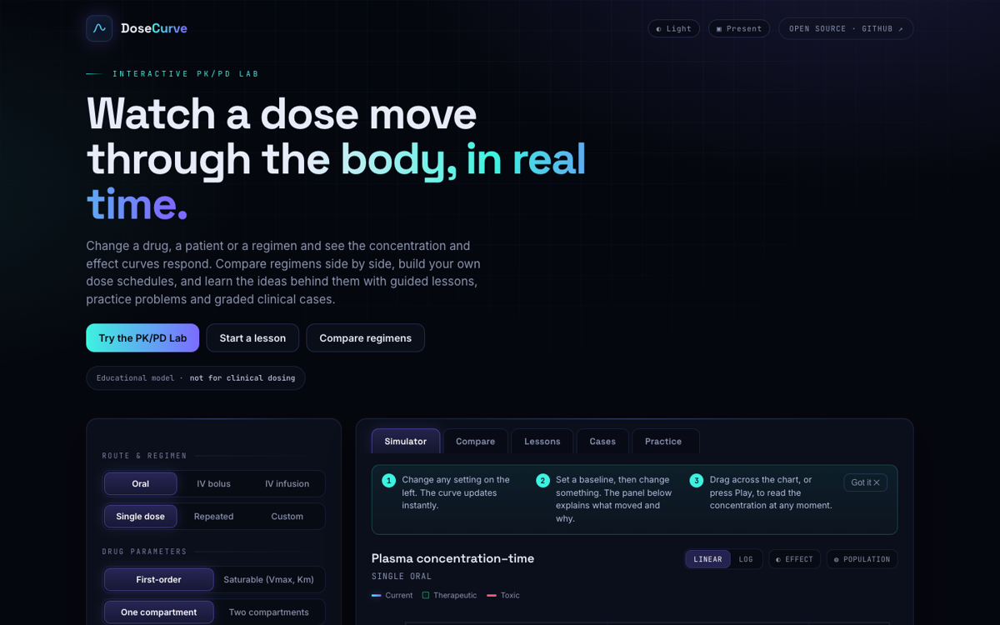
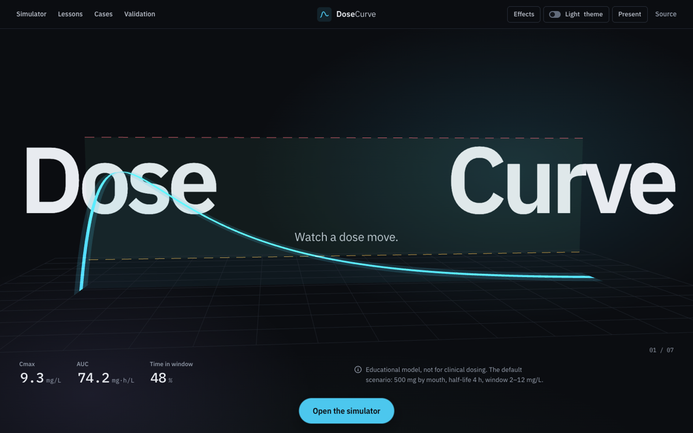
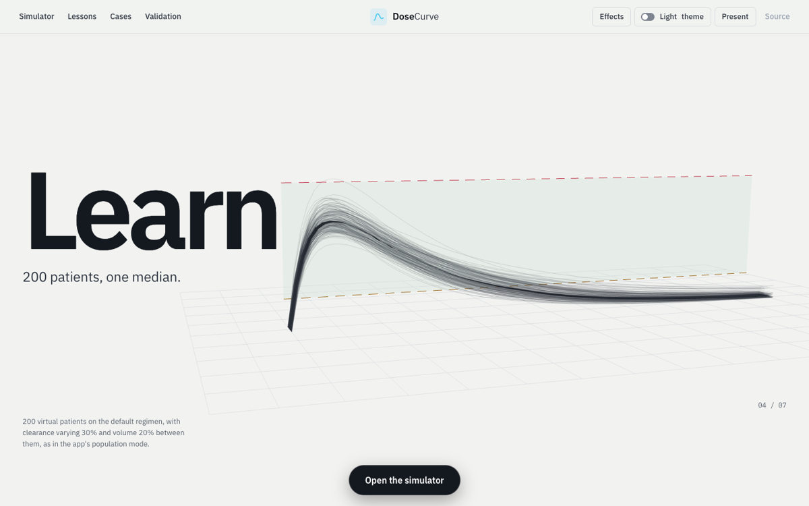

# Changelog

What changed in MaatiRx (called DoseCurve until 2.19), newest first. Every release keeps older share links working and the default scenario's numbers unchanged: Cmax 9.3 mg/L, AUC 74.2 mg·h/L, 48% of the window in range.

## 2.20.0 (2026-10-04)

DoseCurve is now **MaatiRx**, at **https://maatirx.com/**.

- **The name.** The top bar, the opening screen ("Maati | Rx", split by the curve), every page's title, the footer, the citation files and the docs say MaatiRx. The wordmark keeps its weights: "Maati" in the strong weight, "Rx" in the light one.
- **The address.** The canonical address, the link previews, the sitemap, robots.txt, the JSON-LD and the citation files point at https://maatirx.com/. The repository keeps its name, so once the custom domain is set GitHub redirects every saifmaati.github.io/dose-curve/ address to the same path on maatirx.com, and links already shared keep working.
- **A new preview image** for shared links: the opening screen with the new name. The README's screenshots are retaken.
- **Downloads** are named maatirx_compare.csv, maatirx_data.csv, maatirx_plot.png, maatirx-(name).json and maatirx-scenarios-(date).json.
- **What carries over by itself.** Scenario files saved by DoseCurve still import. Completion codes made by DoseCurve still verify. Share links open as before. The names the app saves under in each browser stay the same.
- **Saved work moves with the app.** A browser keeps saved work per address: the scenario library, lesson, practice and assignment progress, a case being written, the theme and effects. Without help, a returning student would find none of it at maatirx.com.
  - Once the old address redirects, a browser that opened 2.20 there still opens the app there from its offline copy (the service worker keeps it). As soon as maatirx.com answers (its certificate can take a day after the switch; until then the old copy keeps working), the app says it has moved, lists what is saved, and offers **Bring it to maatirx.com** or **Not now**. From any old page the work goes to the app page, which takes it in.
  - The work travels in the new link's # part, inside the browser; nothing is sent to a server. At maatirx.com it is added to what is saved there and replaces nothing: scenarios not already in the library are added, a lesson marked at either address is marked, and practice counts take the larger. The page reloads and says what came across, with **Undo**.
  - The old address keeps its copy: the next old link says when the work was brought and offers **Go to maatirx.com** or **Bring it again** (nothing is added twice). Going removes the old offline copy, so old links then go straight to maatirx.com. **Not now** asks again at the next old link.
  - The note says what was actually added: scenarios that didn't fit a full library (200) stay at the old address, and a case being written at both addresses keeps the one here.
  - A link that carries something other than the app's own saved work is ignored, and so is work that isn't the app's own shape. The case form and a worksheet's saved answers are now escaped as they are shown.
  - An open tab reads the library and progress again when another tab changes them, so it can't write back an older copy.
  - This needs 2.20 to run at the old address before the domain is switched; docs/NEEDS-SAIF.md gives the order.
- **Offline.** The service worker's cache is renamed; activating it clears the cache saved under the old name.
- **The 404 page** loads its fonts from the root on a custom domain (it already rewrote its links).
- The fit and window tasks' worked methods ("How?") moved to `pk-explain.js`, loaded with the first press, so the page's first script stays within its budget.

## 2.19.0 (2026-10-01)

Hemodialysis with saturable (Michaelis–Menten) elimination, and a smoother landing.

- **Dialysis for saturable drugs.** The Hemodialysis setting now applies to saturable drugs too. During each session the engine's own Runge–Kutta integrator adds the dialyzer's loss, so dA/dt = input − Vmax·C/(Km + C) − CLd·C.
  - The steps meet every session edge, and shorten where the rates are fast, so the method stays stable at extreme settings.
  - The amount each session removes is CLd times the exact area under each step's curve.
  - Mass balance holds to about 1e-8: what is in the gut and body, what the body eliminated and what the dialyzer removed add up to what was given.
- **Every figure says which level it is read at.** The body's clearance falls as the level rises and the dialyzer's doesn't, so how far a session lowers the level depends on where it starts.
  - The readouts read "t½ at trough", "CL+CLd at trough" and "Fall from trough" (or "at peak").
  - The panel states the level, and what the fall would be from far above and far below Km.
  - A session with no dose during it is solved in closed form.
  - The session list gives each session's actual fall, what the dialyzer and the body each took, and the IV dose that restores the level the session found.
- **No steady state is claimed with dialysis,** for either kinetics, since sessions don't repeat with the doses:
  - The regimen note says so. For first-order dialysis it used to say "0% of steady state".
  - Population mode no longer reports an attainment it can't read; it used to show "0%".
- **Links v15.** A scenario with both saturable elimination and dialysis makes a v15 link. An older link with both opens as it always did, without dialysis, since dialysis did nothing for saturable drugs before.
- **Validation:** four saturable dialysis scenarios added to the SciPy reference, making 15 dialysis scenarios and 735 comparisons on the validation page:
  - an oral daily regimen with doses at the sessions' ends;
  - infusions after a loading dose, with sessions overlapping them;
  - a bolus far above Km;
  - a mixed schedule with reduced kidney function.

  Every existing reference value is bit-identical. A new test file holds the model to mass balance, the closed form of a session, continuity at session edges, and the supplement dose.
- **No dialysis clearance is given for any saturable library drug.** None is sourced, and the model has no protein binding; the default 5 L/h stays marked "typical value, unverified".
- **A smoother landing.** A trace of a full landing scroll found one 87 ms frame in the depth-sort of the population scene's 30,000 points. The sort ran whenever a reader paused mid-scroll. It is now a counting sort on 4,096 depth buckets, about a millisecond. A full scroll on the full 3D stage now drops 1–3 single 33 ms frames on this machine (about 14 in 2.15). The ones left come from the browser rasterising the page as the app scrolls in, with the stage off too.
- **Fixed before release** (a four-reviewer review with a second reviewer checking each finding; 11 confirmed):
  - the readouts crashed for a saturable drug on a custom schedule with dialysis;
  - AUC∞ came out too low when drug was still in the gut at the cut-off;
  - the worked readouts and "What changed" now name the dialyzer's term and each side's level;
  - the 3D population view keeps to a stated subset of patients where a fast dialyzer in a very small body would block the page.

## 2.18.0 (2026-10-01)

Interactive 3D charts. A **3D** switch joins Linear and Log in the chart's head. The 2D chart stays the precise instrument and the default; 3D is for exploring and presenting. Nothing in 3D is part of the first load: its code and Three.js arrive on the first press.

- **The morph.** The 2D chart lifts into space in 600 ms: the 3D copy first lies exactly where the 2D chart is (within a few pixels, checked frame by frame), then the plane tilts, depth arrives and the curve becomes a ribbon. Switching back lands it flat again. Reduced motion swaps them at once.
- **Five views, each from the engine's own numbers:**
  - **Curve in space:** the concentration–time ribbon, coloured by state as on the 2D chart. The window is a glass slab with its MEC and MTC edges, the doses are beads on the time axis, and the grid has labelled ticks. Hovering anywhere on the ribbon gives time and level, and dragging along it moves the page's time cursor. In a custom schedule, clicking a dose's bead selects it in the schedule; in a regular regimen it moves the cursor to that dose. In Compare, both sides can be read, each tagged.
  - **Dose surface:** time × dose × level, the window slab cutting through it with a hairline where the surface crosses the MEC and the MTC. The current dose is a lit line on the surface. Dragging it along the dose axis changes the simulator's dose, snapping to the library drug's own strengths (any sum of up to three, or its rounding step for an injection) or else to steps that suit the dose. The 2D chart and readouts follow live.
  - **Regimen map:** dose × interval × a steady-state target (AUC24, trough or peak; fT>MIC once a MIC is entered), the target range as a translucent band, and the surface coloured where each regimen falls against it. The AUC24 band is Population's AUC target when one is set, else the window held for 24 h, and says which. fT>MIC has no band, because no target was verified. Regimens that never reach a steady state (a saturable drug given faster than its Vmax) are a flat plate marked as such. A marker picks a regimen: dragging it drives the simulator, snapping to practical doses and to 4, 6, 8, 12 or 24 h. A single dose is shown as a regimen of its own interval and labelled as a stand-in.
  - **Population:** population mode's own virtual patients (same seed, same patients as the 2D band) as curves in depth ordered by clearance, with the median lit and the 5th–95th percentile band as glass. Hovering a curve names that patient's clearance and volume.
  - **Compartments** (two-compartment drugs only): the central level against the peripheral level against time. The trajectory's loop away from the plane of equal levels is the distribution phase, coloured by which way the drug is moving. The peripheral level comes from the engine's central level (a test holds it to the closed form after an IV bolus).
- **Handling:**
  - Orbit with inertia, wheel or pinch zoom with limits, pan, and double-click to re-centre.
  - Front, Isometric and Top cameras with eased moves.
  - A slow idle turn (2.5° a second) that stops at the first touch; none under reduced motion.
  - Keys: arrows turn it, + and − zoom, Home re-centres, Escape returns to 2D.
  - The wheel zooms once the chart has been clicked or focused, so the page still scrolls past it.
  - Phones get a simpler view: tier-1 materials, short view names, a compact legend, and taps that read the point under the finger.
- **Materials and labels:** the stage's recipes, tokens and light, with its transmission glass at tier 2. Labels and readout chips are HTML placed by projection, so text is sharp at any angle. The disclaimer stays visible in every view.
- **The Bayesian panel's readings moved to `ui-panels.js`**, with the MIC and dialysis panels', keeping the first load within its budget. A link that opens with levels waits for them, so the page does not shift.
- **Fixed before release** (a four-reviewer review of the 3D code, each finding checked by a second reviewer):
  - Most serious: the landing's 3D stage had stopped starting. A new loader's name was hidden by a variable inside the stage. A test now guards it.
  - Surface hover read nothing at first. It now gives the engine's values, not numbers read back off the clamped mesh.
  - Quick presses or input during the morph could leave the panel half-way between 2D and 3D.
  - Dose snapping could follow the strengths of a drug opened earlier.
  - fT>MIC could show a first-day value as if it were at steady state.
  - Heavy grids were recomputed on every frame of a slider drag; they are now cached until the drag pauses.
  - Escape also left Present mode.
  - Plus about twenty smaller accessibility and wording fixes.

## 2.17.0 (2026-10-01)

An indirect response can sit behind an effect-site delay.

- **Two delays at once.** With an indirect response, the effect-site delay (t½eq) now stays in the controls. The drug acts through the effect-site level Ce, dCe/dt = ke0·(C − Ce), so the response lags the plasma level twice over: first the drug reaching its site, then the response's own turnover.
  - Example, a warfarin-like single oral dose (turnover 5 h): an effect-site t½ of 6 h moves the largest change from 24.1 h to 32.8 h after the dose, while its size barely moves (63 to 62 points below baseline).
  - The response chart, its loop against the plasma level, the readouts, the cursor (which adds the effect-site level), the CSV, the population band and "What changed" all follow the effect-site level.
- **Validation:** 3 indirect responses behind an effect-site delay are added to the SciPy reference: a single oral dose, infusions every 8 h, and two compartments with a Hill slope of 2. That makes 15 indirect responses and 727 comparisons on the validation page. Every existing reference value is bit-identical; the reference integrates Ce only where there is a delay.
- **Links v14.** A scenario with both an indirect response and a delay makes a v14 link. An older link with both opens as it always did, driven by plasma, because before 2.17 the delay did nothing with a response.
- Model and methods says how the delay enters f(C).
- **The MIC and dialysis panels' readings moved to `ui-panels.js`**, loaded once a MIC is entered or dialysis is on (or with a link that opens with either, filled before it shows). The page's first script is 3 kB under its budget again; it had reached the limit with this release.

## 2.16.0 (2026-10-01)

The validation page checks the engine in a worker.

- **The 718 checks run in a Web Worker** (`validation-worker.js`). The worker loads the engine files by their stamped addresses and sends back each check's result and each table as it finishes. The page itself no longer loads the engine, and it stays responsive while the sphere lights.
  - In Lighthouse's simulated phone, script work on the page's main thread falls from 1,079 ms to 162 ms.
  - Largest contentful paint goes from 1.5–1.7 s to 1.4 s, and the speed index from 0.8–0.9 s to 0.7 s.
  - Performance scored 99–100 over three runs before and after (it varied 97–100 in earlier runs).
- **Without a worker** (for example a page opened from the file system), the page loads the same files and runs the same checks itself, handing the page back between them, as before.
- A test runs the worker's checks in Node: one result per point on the sphere, all 718 within tolerance, each table complete. It also checks that the worker accepts only this site's stamped engine files.
- **NEEDS-SAIF** catches up: pull requests merged through #36, Releases through 2.15.0. The branch clean-up command no longer switches branches and leaves the checked-out one alone.

## 2.15.0 (2026-10-01)

Motion and tabs (the final brief, part 3).

- **One virtual scroll on the landing:**
  - A single value eases toward the real scroll each frame (lerp 0.1), and the camera, the objects and the headlines all share it.
  - Headlines crossfade as each scene arrives and leaves: 0.8 s transitions of opacity and transform only, eased cubic-bezier(0.22, 1, 0.36, 1). The focus pulls in 3D at each hand-off.
  - The blur on headlines is gone. Native scrolling is left alone, and the gentle snap waits until a trackpad's momentum has run out.
- **The frame budget:**
  - The cloud of 200 patients re-sorts only when the camera rests, and the second theme's shaders compile only once the reader pauses.
  - The globe's glass is hidden once it has cleared, the validation checks pre-run in idle time, and the floor's reflection redraws every other frame while moving.
  - A stricter governor drops the post-processing passes and the glass's transmission after three frames over 20 ms in 4 s of motion.
  - Measured over a full scroll in this machine's headless Chrome: with the 3D stage off, 3 of 1,722 frames over 20 ms (all single 33 ms frames). With the tier-2 stage, about 14 of 1,700 (0.8%), all single 33 ms frames except, in some runs, one 50 ms frame at the hand-off into the app. The brief's "none" is not reached on the tier-2 stage on this machine.
- **Tabs:**
  - Each tab has its own address (`#app`, `#compare`, `#lessons`, `#cases`, `#practice`). A switch adds it to the history, so back and forward walk through the tabs in the page, without a reload.
  - The content crossfades in 0.5 s, and the top nav's hairline slides to the open tab.
  - Once the page is idle, the other tabs' files (lessons, cases, practice) arrive ahead of a click.
  - A lesson, case or practice link asks for its files from the page's first lines, so it opens without waiting (a lesson link was ready in 184 ms).
  - A jump to the app leaves the fixed top bar clear of the chart's tabs (before, they sat underneath it).
- **Polish:**
  - The library and the Keys dialog open as glass sheets.
  - The effect box stays closed until its charts can draw, so it never shows empty.
  - The worksheet's view is a lazy file (`ui-worksheet.js`).

## 2.14.0 (2026-10-01)

The simulator becomes a workspace on a desktop (the final brief, part 2).

- **The chart takes the screen:**
  - On a screen 1100 px or wider, the simulator and compare are one workspace the height of the screen, and the chart's glass panel fills it.
  - The plot is drawn one unit to a pixel at whatever size the screen gives it, so its type stays true to size. It redraws when that size changes.
- **The controls become a slim glass rail** on the left, with one line icon per section:
  - It opens over the chart on hover, on keyboard focus, or with a click on a section, which scrolls to that section.
  - The top button keeps it open; Escape or a click elsewhere closes it.
  - Every control is still in reading order, so the keyboard reaches them all.
- **The readouts are a HUD** strip right under the chart, before the time inspector.
- **Focus mode** (the toolbar's Focus, or F): the chart and its HUD alone. Escape leaves.
- **The stage behind the chart shows the same scenario in 3D:**
  - The ribbon, the window as a glass plane, the doses as pulses, and now the frosted-glass figure beside it. The figure's level is the concentration at the time cursor, else at the peak.
  - Centred behind the chart's glass in the workspace.
  - A change morphs the 2D chart and the 3D ribbon together, and the camera drifts toward the part of the curve that changed most, then settles back.
- **Elsewhere:** phones, the paper pages (lessons, cases, practice), present mode and embeds keep their layouts.
- **Small details:** panels lift a pixel under the pointer, and focus rings are drawn as an accent ring.

## 2.13.0 (2026-10-01)

The concentration chart rebuilt as an object rather than a plot. Its data, ids and tests are unchanged.

- **The curve:**
  - A 2 px line whose colour runs along its length by state: cool and dim below the MEC, luminous inside the window, warm toward the MTC and hot past it. Time above the toxic threshold is the curve itself going hot.
  - A 1 px brighter core, and a soft glow in the dark theme.
  - Underneath, a gradient from the curve's colour at 25% to nothing, with a faint grain, and a 10% reflection under the baseline that fades within 26 px.
- **The drug, flowing:** luminous points travel along the curve, spaced evenly in its cumulative area, so a high peak is crowded and a low trough sparse.
- **Drawing and morphing:**
  - The curve draws itself left to right with a glowing head the first time the chart comes into view, and while Play runs, up to the play head, which leaves a wake.
  - Any discrete change morphs every layer over 300 ms. Switching to a log scale morphs the curve while the grid crossfades.
- **Superposition:**
  - In a repeated regimen or a schedule, each dose's own curve (the engine's single-dose solution) is drawn faint under the total, so the doses visibly stack into steady state.
  - Pointing at a dose's tick lights its curve, and pointing at a schedule row lights its interval.
  - Ticks pulse as the play head crosses them.
- **The window and thresholds:**
  - The window is a band of glass: soft edges, a 7% fill, a lighter hairline at each boundary and a slow shimmer.
  - MEC, MTC and the MIC are solid hairlines with small labels in the right margin, kept apart.
  - Axes are hairlines with major and minor ticks. Labels use tabular figures, and units appear only in the axis titles.
- **Labels:** the peak (and a regimen's trough) is a small ring with a thin leader to its value. Labels are placed where they collide with nothing.
- **Depth:** the plot plane tilts two or three degrees toward the pointer while its grid moves in parallax, with a faint vignette inside the plot.
- **The crosshair:** a hairline, a dot riding each curve, a time chip on the axis and a glass value chip, updated at most once a frame. Keyboard scrubbing shows the same crosshair.
- **Compare:** a baseline is a ghost (1 px, 35%, no glow). The difference is a soft shaded region, and its largest gap is marked and labelled where it happens.
- **Population:** the middle 90% and the middle 50% (the worker now gives the quartiles) as layered glass, with the median luminous.
- **Light theme:** ink on warm paper, the same grammar, no glow.
- **Reduced motion:** no particles, draw-on, shimmer or tilt.
- **Two new lazy files keep the first load within its budget:**
  - `ui-chartfx.js`, the chart's motion, loaded just after the first paint.
  - `ui-effect.js`, the effect charts, loaded with the Effect switch. A link that opens with them waits for them.

## 2.12.0 (2026-10-01)

The app rebuilt as an instrument panel: two typefaces with tabular figures, one restrained accent, glass and hairlines instead of boxes, and a chart drawn like an instrument.

- **Type:**
  - Inter for words and numbers (tabular lining figures) and Newsreader for display: chart titles and the large, light readout numbers. No monospace anywhere in the interface.
  - Both are served from the site, preloaded, with metric-matched stand-ins so nothing shifts when they arrive. The giant headlines have a stand-in of their own.
- **Colour:**
  - One accent, champagne on the dark instrument and brass on paper, for the curve and the primary action only. Sky blue is retired.
  - A second scenario is platinum (slate on paper). MEC and MTC are desaturated teal and rose.
  - Every text colour keeps AA contrast against the page and the panels in both themes, checked by a test.
- **Structure:** panels are glass: a hairline, a faint fill over the page's own colour, a 20 px blur, a top highlight and a deep shadow. Inside them, hairline rules replace nested boxes: worked panels, notes, case facts, scenario and case cards, the compare table.
- **Controls:**
  - Choices are text tabs, with the chosen one in a hairline pill that slides to it, and toggles are slimmer.
  - The drug library is a hairline list: name left, regimen right.
  - Sliders have a hairline track and a small glowing thumb. Their value is an editable field: type a number and press Enter. It is clamped to the slider's range, Escape restores it, and it is as wide as the longest value, so nothing jitters.
- **The chart:**
  - Hairline axes with tick marks, gridlines at 5%, and the window as a lighter band.
  - MEC and MTC are solid hairlines labelled with their values.
  - The curve is a soft glow, a 2 px stroke and a 1 px lighter core over a gradient fill.
  - The peak is a ring with a leader to its value. The crosshair has a time chip on the axis and a glass value chip.
  - A discrete change (a choice, a typed value, a drug) morphs the curve to its new shape over 300 ms. A slider's drag draws it as it moves, and so does reduced motion.
- **Readouts** are one row of large light numbers divided by hairlines, with each unit under its number. The steady-state stats and "When to sample" use the same style, and the sensitivity tornado has thin bars on hairline rows.
- **The pill** belongs to the landing only. In the app, a quiet toolbar in the chart's head carries Baseline, Compare and Share (the controls' own buttons are still there).
- The landing's ribbon and objects take the new accent: champagne on deep blue-black.

## 2.11.0 (2026-10-01)

Objects in the scenes, lit like product photography, each moving only by the engine's numbers. Two new scenes, Exposure and Rebound, make nine.

- **Hero:** a two-tone capsule at the curve's start dissolves as it empties, e^(−ka·t). Its particles leave at times that follow absorption and land on the ribbon, drawing it. The cold open's draw is eased in so the dissolving can be seen.
- **Every dose:** a frosted-glass figure, the model's one compartment. Its liquid stands at the default scenario's concentration, between hairline rings at the MEC and MTC, with the capsule dissolving inside it.
- **Simulate:** a capsule at each dose, dissolving from its own dose time.
- **Learn:** 200 glass vials, one per virtual patient, fill to each patient's level at 4 hours. They then sort by it: the middle 90% lit, the middle two (the median, 7.0 mg/L) in bronze. The numbers are in the text.
- **Cases:** two connected glass chambers hold the central and peripheral amounts, A₁(t) and A₂(t). Particles cross the tube at k₁₂·A₁ and k₂₁·A₂.
- **Exposure (new):**
  - Piperacillin 3 g every 6 hours against an MIC of 16 mg/L, as a 30-minute and as a 3-hour infusion (the app's "Extended infusion" pair).
  - Two culture dishes dim by each regimen's share of time above the MIC, and the counters count to 47% and 69%.
  - The text says the dimming is a visual cue, not a model of bacterial killing.
- **Rebound (new):** the rebound lesson's patient through one hemodialysis session. A dialyzer cartridge runs at the removal rate CLd·C(t) during the session, the level falls 53% and then rebounds to 6.3 mg/L, and a counter shows the 245 mg removed.
- **Validated:** the 584 checks sit inside a glass globe in a brass armillary on a turned stand. To open the simulator, the camera flies into the globe (its glass clears as the camera nears it), among the checks, and out to the simulator.
- **Phones** get the capsule, the figure and the vials with simpler materials. The other scenes keep their SVG frames, which now include the MIC's shaded time and the session with its rebound.
- **Under the hood:**
  - Everything is procedural: there are no model files.
  - The vials' glass skips transmission, since 200 overlapping transmissive vials cost 50–100 ms frames.
  - Shaders compile group by group before the sequence plays, and the second tone's after the cold open.
  - pk-hd.js loads a scene ahead.
  - The sequence is now 18 screens.

## 2.10.0 (2026-10-01)

The opening sequence becomes one continuous film, and the long-form text moves to its own page.

- **One world, one camera.** The seven scenes sit in one world, and one camera travels through them on a path through each scene's resting frames. The camera is scrubbed by the scroll with inertia smoothing, and when scrolling stops near a resting frame it settles there gently. Each scene spans two screens of scroll (14 in all); its frame is pinned while the camera plays its beats:
  - **Hero:** the ribbon draws, the window rises, the readouts land one by one.
  - **Simulate:** one dose, then a second stacking on what is left of the first, then the climb to steady state.
  - **Learn:** 200 patients appear one by one as a cloud of points, then condense into the median and the band.
  - **Cases:** the camera dives into the two-phase curve, the axis turns logarithmic in front of it, and the phases separate.
  - **Validated:** the 584 checks light one by one, then the camera pulls back to the whole sphere.
  - **Open:** the camera flies to the simulator, and its own curve is simply there.
  A thinner strand of the ribbon runs from each scene to the next, so the camera always follows one object. Headlines reveal as the camera arrives and dissolve as it leaves, with the focus pulling between ribbon and text, and they settle fully shown or fully gone whenever scrolling stops.
- **A cold open** before any scroll: black, first light on the ribbon as it draws, the wordmark revealed by a mask (about four seconds), then a quiet scroll cue. The skip link and the pill stay visible throughout.
- **The sequence plays on every visit** to the address itself, not only the first: the remembered "seen" skip is gone. `#app` and every content link (a lesson, a case, practice, a share link, a worksheet) still open the app directly. Reaching the app from the sequence adds one history entry, so the browser's back returns to the sequence and forward to the app, without a reload; Home in the top bar brings the sequence back from anywhere.
- **Rendering.**
  - **The ribbon** is a swept mesh with thickness and bevelled edges: an emissive core with glow trails in dark scenes, clearcoated graphite (physically based) in light ones.
  - **The window** is frosted glass with transmission.
  - **The world:** a studio environment (PMREM) with a warm key, a cool rim and a soft fill; a floor with a faint grid receding into exponential fog and, on capable machines, a blurred mirror reflection; slow dust catching the key light; light shafts in dark scenes.
  - **The 200-patient cloud** is depth-sorted additive points with size attenuation.
  - **Post-processing**, all this site's own code since cdnjs carries only Three.js's core: selective bloom on emissive elements, depth of field with a rack focus, chromatic aberration at the edges, ACES tone mapping with exposure per scene, and a grade (deep blue-black with one warm accent). Grain and a soft vignette are a CSS layer.
- **Tiers.** The full passes run only on a desktop with a GPU. A software renderer, a phone or a modest machine draws directly with simpler materials, and phones keep the single ribbon with the CSS frames. A governor switches the passes off if frames run slow, the pixel ratio is capped at 1.5, rendering pauses while the tab is hidden, and the intro's dust drifts at 30 fps when nothing else moves. Under reduced motion everything is still and each scene holds its last resting frame. Without Effects, the CSS and SVG stage is unchanged.
- **Model and methods** (new page, `methods.html`, styled like the validation page). It has every equation the simulator solves as MathML, how routes and schedules are modelled, what the tests cover, the full disclaimer, the privacy, effects and visit-counting statements, and how to cite. It is linked from the footer and the validation page and kept for offline use.
- **The footer** is four quiet lines on the stage: the mark; Model and methods, Validation, For educators, Teaching guide, Source, Feedback; "Educational model, not for clinical dosing"; the version and date.
- **A child patient** (Patient → Child). Weight (0.5–80 kg, on a log slider), gestational age at birth and postnatal age give renal maturation and size by Rhodin et al., *Pediatr Nephrol* 2009 (GFR = 121.2 mL/min × (WT/70)^0.75 × PMA^3.4 / (47.7^3.4 + PMA^3.4), verified against the abstract). The drug's renal part follows that GFR; its non-renal part scales with size alone. The panel works the numbers through, and "What changed" explains a change in age or weight. Links v13; an older link keeps the 40 kg floor it had.
- **The DOI** (10.5281/zenodo.23082408, all versions) is in the README (badge and How to cite), CITATION.cff and Model and methods. The CITATION and Zenodo abstracts describe the current model.
- docs/NEEDS-SAIF.md records the merges and Releases as done; the merged branches' deletion is a command to paste.

Lighthouse on mobile: the root address 93 (desktop 89: the cold open's black first second weighs on its Speed Index); accessibility 100 and layout shift 0, also on all 111 link kinds. axe: no violations. A 20-second capture of the sequence: 0 frames over 34 ms while scrolling. 391 tests in 22 files.

## 2.9.0 (2026-10-01)

The glossary, the README and the practice problems catch up with 2.4–2.8.

- **Two glossary terms** (71): *Terminal half-life* (ln 2 / β, longer than the central compartment's own) and *Post-distribution peak* (drawn once distribution is over; When to sample gives the model's time, and the vancomycin guideline's two-level approach draws it 1–2 hours after the infusion, Rybak et al. 2020).
- **A practice problem kind** (43): Cockcroft–Gault with the ideal (Devine), adjusted or actual weight of a heavy adult, worked step by step, ending with what the other weight would have given. It is new in worksheet version 9, so every worksheet link shared before keeps its exact problems (a test rebuilds a version-8 sheet).
- **README images:** two new ones, the rebound after a dialysis session and population mode's band on the effect chart. Every chart image is retaken so its legend shows whole; until now each was clipped at the top.

Every link kind, the new problem's included, opens with zero layout shift at 390 px. 387 tests in 22 files.

## 2.8.0 (2026-10-01)

Every lesson link scores 89 or more on mobile.

- **Lesson links render faster.** A lesson link renders several times as its files arrive (the lesson's texts, the explanations, the stage), and each render recomputed the same window statistics, readouts and dose-by-dose peaks and troughs. The engine now keeps the last 64 of each. They are keyed by the scenario's link, so a changed setting always computes afresh, and by whether the dialysis model has loaded. Each caller gets its own copy. A repeated comparison takes 1.2 ms instead of 3.0.
- **Results.** A Lighthouse run on all 36 lesson links found one below the floor of 85: the Bayesian-estimate lesson at 78 (73 with a layout shift on 2.4.0). It now scores 89, with blocking time 780 → 370 ms. The other low scorers rose too: continuous vs intermittent 88 → 94, piperacillin 87 → 94, gentamicin divided vs once daily 89 → 95, the CrCl lesson 91 → 94. Every link kind still opens with zero layout shift at 390 and 1440 px.

Lighthouse on mobile: the root address 99, the validation page 99. 386 tests in 22 files.

## 2.7.0 (2026-10-01)

Hemodialysis with two compartments, and the rebound after each session.

- **Dialysis works with two compartments.** The dialyzer clears the central compartment, and the central and peripheral amounts are carried exactly from one event to the next (a dose, an infusion's end, a session's start or end) through the two-compartment system's eigenvalues. Mass balance holds to 10⁻⁹: what was given is in the gut, in the two compartments, cleared by the body or removed by the dialyzer. A fine-step check agrees to 10⁻¹².
- **The rebound.** After a session, drug moves back from the tissues and the level rises before the slow fall resumes. The session list gives the rebound's level, when it comes and the share of the fall it gives back. Example: 5.53 → 6.33 mg/L, 1.6 hours after a 4-hour session, 13% of the fall back. The fall per session is taken from the terminal phase, and its worked formula says so. The clearance for a stated fall is found by bisection.
- **A new lesson, "Rebound after dialysis"** (36 lessons). It compares one compartment with two at the same clearance and total volume. The two-compartment level rises 14% in the 1.6 hours after the session, while the one-compartment level keeps falling. The session also removes less with two compartments (245 mg against 306), because the dialyzer only reaches the blood. The challenge: slow the return from the tissues until the rebound gives back a quarter of the fall. The glossary's "Post-dialysis rebound" now links to it.
- **Validation:** 3 two-compartment dialysis scenarios added to the SciPy reference (11 in all; 718 comparisons on the validation page). The existing 8 changed by at most 2 parts in 10¹² with the solver's extra state.
- **Links v12.** A scenario with both dialysis and two compartments makes a v12 link. An older link with both opens as it always did, with dialysis off, because before 2.7 it did nothing with two compartments.
- The teaching guide's list of one-click comparisons is regenerated from the app (28; it said 18).
- **Faster dialysis scenarios:** a level now takes a fifth of the time, since each scenario remembers its course while its settings are unchanged. The rebound lesson's link scores 89 on mobile and the dialysis lesson's 86 (83 with a layout shift on 2.4.0).
- **"What changed" corrections.** It said the total AUC stays the same when only the compartments, the volume or the absorption rate change. With dialysis that's no longer true, because what a session removes follows the level. It now gives the actual difference, for example 9% higher with two compartments.

385 tests in 22 files.

## 2.6.0 (2026-10-01)

Population mode carries through to the effect.

- **The effect gets a population band.** With population mode and the effect charts both on, the effect chart shades the 5th–95th percentile of the same virtual patients' effect, with the median dotted. It covers a direct Emax, an effect-site delay and an indirect response. Only the levels vary, so the band shows how the spread in level carries through to the effect. The panel adds one sentence: at the moment the median effect is furthest from baseline, the effect's spread beside the level's. With the default drug at steady state, a 1.8-fold spread in level is 13 points of effect near the peak, while the troughs, lower on the curve, spread far wider. In Compare each scenario gets its own band.
- Indirect responses are solved faster: each solver step reuses the level it has already computed at the half step and the step's end, with bit-identical results. Population bands use at most 2,000 steps per patient, within 0.05 points of the full solution. The worker loads the response model when it needs it.

375 → 379 tests in 22 files. axe: no violations, the band included.

## 2.5.0 (2026-10-01)

Every link opens without the page moving, and the first view loads less.

- **Lesson links no longer shift the page.** A lesson link showed the lesson before its texts arrived, and the texts then pushed the chart down. The shift reached 0.23 on phones (seven lessons above 0.1, the threshold Lighthouse flags) and dates from when the texts moved to their own file. A lesson link now shows once its texts (and any model it needs) are in place.
- **`#cases` no longer shifts the page.** The case list filled in after the tab showed (a shift of 0.63). The tab now waits for the list, as a single case's link already did.
- Every kind of link was measured at 390 and 1440 px: all 35 lessons, 40 practice kinds, 7 worksheet topics, each Fit the data and Hit the window kind, all 16 cases and each tab by name. Layout shift is 0 on every one.
- **The "What changed" sentences moved to their own file** (`pk-explain.js`), unchanged: 526 of 526 scenario pairs give identical text before and after. The file loads just after the first paint, and a link that opens with a baseline or in Compare waits for it. The initial script falls from 24.7% to 18.0% over the Phase 0 baseline, which leaves room under the 25% budget for later features. The sentences now have tests of their own: the README's example word for word, every lesson's pair in both modes, and a single change to every library drug, all in descriptive words with no empty numbers.

Lighthouse on mobile: the root address 99, a lesson link 90 (86 with a 0.16 shift before), `#cases` 97; accessibility 100, layout shift 0. 375 tests in 22 files.

## 2.4.0 (2026-10-01)

Teaching additions after the redesign: when to sample, a lesson on the weight in Cockcroft–Gault, a case of the day, and documents for contributors.

- **When to sample.** Under the steady-state chart of any repeated regimen, a new section gives the dose from which the regimen's peak and trough are within 10% of steady state (and within 3%), and the model's sampling times in that interval. The trough is at its end, just before the next dose. The peak is at the end of an infusion, at the oral Tmax, or straight after a bolus. With two compartments it is the moment distribution is 90% complete: ln(9A/B)/(α − β) after the infusion ends, when the distribution phase is a tenth of the level. A **Show** button moves the time cursor to each time, widening the chart if needed. Example: for vancomycin 1 g over an hour every 12 h with two compartments, distribution is 90% complete 1.4 h after the infusion ends, inside the 1–2 hours the 2020 guideline gives for a post-distribution peak. These are the model's times, and the section says a protocol sets the real ones. The section loads when it opens (`pk-tdm.js`).
- **A new lesson, "Which weight for CrCl"** (35 lessons). A 130 kg man, 175 cm tall (ideal weight 70.5 kg), on a drug 90% renally cleared. Cockcroft–Gault with his ideal, adjusted or actual weight gives a CrCl of 88, 118 or 163 mL/min and a predicted trough of 6.1, 4.0 or 2.3 mg/L: a 2.7-fold spread from one patient and one creatinine. The challenge asks for the interval that restores the ideal-weight trough when actual weight is used. The tests check every number in it.
- **Case of the day.** The case list opens on one case, the same for everyone on a given date (it changes at midnight UTC), so a class can work one case together without a link.
- **For contributors:** [docs/ARCHITECTURE.md](docs/ARCHITECTURE.md) (the files, the rules the code keeps, the stage, validation) and [CONTRIBUTING.md](CONTRIBUTING.md). `node tools/stamp.js` restamps every file loaded on demand after a change.
- Printing leaves out the pill, the masthead and the 3D stage.

Lighthouse on mobile: the root address 96–99 over three runs, a two-compartment vancomycin link 94; accessibility 100 and layout shift 0. axe: no violations, including the new section in both themes. 371 tests in 21 files. The initial script is now 24.7% over the Phase 0 baseline, within the 25% budget.

## 2.3.0 (2026-10-01)

The redesign's last stage: validation, educators, README and link previews (storyboard in [docs/DESIGN.md](docs/DESIGN.md), section 14). A summary of the four 2.x releases is in [docs/REDESIGN_REPORT.md](docs/REDESIGN_REPORT.md).

- **The validation page opens on a sphere of 712 points**, one per comparison the page runs against the independent solver, lighting as each one passes (a failed one would turn red), in 3D with Effects on and as SVG dots otherwise. Behind it, the word reads "Validating" while the checks run and "Validated" when every one has passed ("Checked" if any hasn't). It turns with the scroll.
- **The educator page is a paper page** under the headline "For ··· educators", crossed by the default curve drawn from the engine.
- **README:** new screenshots in the 2.x look (the opening screen, a lesson on paper, the population screen, and the simulator, Compare, lesson, case and validation images refreshed).
- **Link previews:** a new image (the opening screen, rendered from the engine) and text with the current counts (34 lessons, 16 cases); a test keeps the counts current.
- Long lesson titles fit their masthead (the headline sizes itself to its words).

Lighthouse on mobile: the root address 99, validation 99 (desktop 100), educators 100; accessibility 100 and layout shift 0. axe: no violations. 362 tests in 20 files.

## 2.2.0 (2026-10-01)

The redesign's third stage: Lessons, Cases, Practice, Fit the data and Hit the window as paper pages (storyboard in [docs/DESIGN.md](docs/DESIGN.md), section 13).

- **Paper pages.** Opening Lessons, Cases or Practice, or starting a lesson, a fit or a regimen task, turns the app to its paper palette: the top bar, the panels, the charts and the 3D ribbon, now solid graphite. The simulator and Compare stay dark. With the light theme everything is paper, as before.
- **A masthead** over each one: a giant split headline with a short caption ("Guided ··· lessons, predict first, then check"; a lesson's own title, split, with "Lesson n of 34"; "Clinical ··· cases"; "Practice"; "Fit the ··· data"; "Hit the ··· window"). The ribbon crosses it, over the words and under the caption. The tab's own heading is unchanged for screen readers.
- **Each case is a dossier:** the case facts in an open accordion, the measured levels in a dark panel, then the task, the walkthrough, what a pharmacist also weighs and the sources as accordions.
- **The pill** follows these screens too: Start a lesson, Next lesson, Open a case, Check regimen, Check the answer, Next problem, New data set, New drug.
- On a phone the page's own panel comes before the controls on these screens.
- Links to a lesson, a case, a practice problem, a worksheet or a task open straight on their paper page, decided before the first paint; a case link shows the app once the case is on screen. Layout shift stays 0.
- Faster: the lit graphite uses a lighter material, the sliding parts are placed once per frame, and the opening sequence's scenes are computed only when it is shown.

Lighthouse on mobile: the root address 99, `#lessons` 97, a case link 96; accessibility 100 and layout shift 0. axe: no violations. 361 tests in 20 files.

## 2.1.0 (2026-10-01)

The redesign's second stage: the simulator and Compare on the 3D stage (storyboard in [docs/DESIGN.md](docs/DESIGN.md), section 12).

- **The ribbon eases into a new shape** when a setting changes, over about a quarter of a second, instead of jumping; the window plane and the dose rings follow at once. With reduced motion it jumps.
- **The time cursor rides the ribbon:** dragging across the chart, the arrow keys or Play move a marker along the 3D curve at the same moment (a point on the curve, a line down to the floor, a ring where it meets it).
- **Population mode on the stage:** a cloud of the virtual patients' curves around the ribbon (up to 150 drawn), from the same sampler and seed as the app's population mode, so the cloud and the chart's bands describe the same patients.
- **Compare:** A and B as two ribbons in their own colours, separated in depth.
- On a phone, the stage steps back behind the app's text (it has no margins to sit in); the opening sequence is unchanged.

Lighthouse on mobile: the root address 97, `#compare` 97; accessibility 100 and layout shift 0. axe: no violations. 360 tests in 20 files.

## 2.0.0 (2026-10-01)

DoseCurve's first visual redesign, the first of four 2.x releases (the plan and its storyboards are in [docs/DESIGN.md](docs/DESIGN.md)). The engine, the share links and the default scenario's numbers are unchanged.

| Before (1.17.1) | After (2.0.0) |
| --- | --- |
|  |  |

- **A 3D stage.** The current scenario's concentration–time curve is a ribbon in space, drawn live from the curve the chart has just computed, with the therapeutic window as a translucent plane and doses as rings that pulse. It glows on dark sections and turns to solid graphite on light ones. The camera moves to a framing for each tab and drifts with the scroll. It renders only when something changes.
- **An opening sequence** on a first visit to the address itself (no `#` part): seven screens, each with one giant headline and a short caption, built from the engine. The default curve draws itself as its Cmax, AUC and time in the window count up; a regimen's doses pulse as the curve reaches them; 200 virtual patients draw in to their median; a two-compartment drug splits into its two phases; and a sphere of 584 points lights up as the engine is checked against the independent solver in your browser.  Any link with a `#` part, and any later visit, goes straight into the app; the DoseCurve wordmark brings the sequence back.
- **Effects** in the top bar switches the 3D stage on or off (remembered in this browser). It starts off with reduced motion, under 4 GB of memory, under 4 processor cores or Save-Data. Without it, or without WebGL, a CSS version stands in: soft light and the same curve as a path in perspective. Phones get the single ribbon. Present mode and print stay plain.
- **A new shell:** a top bar with the main links on the left, DoseCurve in the middle and the switches on the right, and one pill-shaped main action pinned at the bottom of every screen ("Open the simulator" in the sequence; in the app, the open tab's main action: set the baseline, swap A and B, start a lesson, open a case, check an answer).
- **Type and colour:** IBM Plex Sans and IBM Plex Mono, served from this site (no request to Google), with fallbacks matched to their metrics so nothing moves when they arrive; tabular figures for every number. New colour tokens for a dark instrument theme and a light paper theme, each designed for its room. Panels are frosted glass over the stage, at an opacity that keeps every text colour at WCAG AA contrast whatever the stage shows.
- **Charts drawn for the theme:** every chart now takes its colours from the theme, instead of the light theme inverting the dark charts; the PNG export matches the theme on screen, and printing always uses the paper colours. On phones the charts are drawn narrower so their labels stay readable.
- **Controls:** segmented controls with a sliding thumb, a tab indicator that slides, sliders with a filled track and a value bubble while they move, switches for Effects, Population and the theme, readouts whose numbers run to their new value in 200 ms, a crosshair (both lines) on the chart.
- **Copy:** sentence case throughout, no arrows appended to buttons, no decorative middle dots.
- **Stable layout:** no layout shift on the root address or on any link: a link with a `#` part shows the app once it's applied, and the parts that load later (the practice problem, the validation summary) hold their space.
- **Privacy:** the fonts no longer come from Google. With Effects on, the stage loads Three.js (a pinned copy, checked by hash) from cdnjs.cloudflare.com; the footer says so, and with Effects off it is never requested.
- The validation, educator and 404 pages use the same type, colours and header.

Lighthouse on mobile (simulated slow 4G): the root address 97, a deep link 98–99, validation 100, educators 100; accessibility 100 and layout shift 0 on every one. axe: no violations in 13 states of the app, in both themes, at 1280 and 390 px, or on the other pages. 359 tests in 20 files.

## 1.17.1 (2026-09-30)

Fixes from the review passes and a 1,000-seed cross-check that closed Build Plan V2 (see [docs/BUILD_REPORT_V2.md](docs/BUILD_REPORT_V2.md)):

- **Population mode on dialysis:** the bands now follow the sessions (the worker loads the dialysis model too).
- **The Bayesian estimate on dialysis** says dialysis isn't covered, instead of assuming the clearance stays the same between levels.
- **Peaks at a session's start or end:** the window's peak and the dose-by-dose peaks now treat each session edge as a kink, where they could miss a peak sitting exactly on one (by up to 4e-5). The indirect-response integrator steps to session edges too, with finer steps.
- **Sensitivity off steady state** reads the AUC over the time window, not the first 24 hours (which is zero for a schedule that starts later); the button says AUC.
- The glossary's post-dialysis rebound entry no longer gives a timing its sources don't state.

## 1.17.0 (2026-09-30)

- **A page for educators** (`educators.html`, linked from the footer and the README): what DoseCurve covers, how to run a class in ten minutes (pick material, write a case, make an assignment, collect completion codes), a link to every lesson (the same share link the app makes, which opens the lesson with its scenario and challenge) and every case, the practice topics, and privacy. Its numbers come from the app itself, and a test checks every link still opens what it says.
- Links like `#practice`, `#lessons`, `#cases` and `#compare` open that tab.
- **README screenshots** for the antimicrobial comparison, an indirect response, hemodialysis and the sensitivity chart, and a fresh one of the validation page (712 comparisons).
- **The validation page** loads its scripts without blocking the first paint and hands the page back between each check, so it stays responsive while it runs; its summary keeps its size as the results arrive. Lighthouse on mobile: app 97–100, validation 97, educators 100 (desktop 100).
- On the chart, an unbound-level label near the right edge sits left of its peak instead of being cut off.

## 1.16.0 (2026-09-30)

- **Sensitivity: which input matters most?** Under the readouts, each input is moved 20% down and 20% up, one at a time with everything else held: clearance (with the volume held, so the half-life follows), volume (with clearance held), F (capped at 1), kₐ, the dose and the dosing interval, plus k12 and k21 with two compartments and Vmax and Km for a saturable drug. The liver model sets clearance and F itself, so they aren't moved there.
  - A tornado chart shows the change in AUC24, the peak, the trough or the time in the window, largest first, and a sentence names the input that matters most, with its numbers: for a regular regimen, "AUC24 at steady state is most sensitive to clearance and dosing interval: −20% changes it by +25.0%, +20% by −16.7%."
  - A regular regimen is read at steady state; a single dose, a custom schedule or a regimen on dialysis over the time window (the AUC over the first 24 h, the window's peak and the level at its end).
  - It is computed and drawn only while its panel is open, from its own file.
- **One glossary term (69):** sensitivity analysis.
- Tests hold it to the closed forms: clearance ±20% moves AUC24 at steady state by +25% and −16.7% for every route, one and two compartments and the clinical patient; the dose moves AUC24, the peak and the trough in proportion; the interval moves AUC24 like clearance; the volume leaves AUC24 alone, and moves an IV bolus's steady-state peak exactly as (D/V)/(1 − e^(−kτ)) says. Every input's sign is checked, and a saturable drug's exposure rises more than in proportion to the dose.

## 1.15.0 (2026-09-30)

- **Hemodialysis.** Under the patient, **Hemodialysis** adds sessions: the dialysis clearance, the session length, when the first starts and how often they repeat. While a session runs, the dialyzer's clearance adds to the body's own.
  - Between any two events (a dose, an infusion's end, a session's start or end) the model is solved exactly, and the state is carried from one to the next, so the curve, the area and the amount each session removes (the dialysis clearance times the area under the concentration during it) are exact. It lives in its own file, loaded when dialysis is on.
  - The chart marks each session. The panel lists, for each session in the window, the level as it starts and ends, the fall, the amount removed and the IV dose right after it that would restore the level, rounded.
  - The readouts show the clearance off and on dialysis and the fall per session (each with its worked formula). The steady-state readouts give way, because sessions don't repeat with the doses.
  - What changed, Compare, the inspector and links (version 11) include it. One compartment: there is no post-dialysis rebound, and the panel says so. The default dialysis clearance is a typical value, flagged unverified.
- **A case (16 in all), *Gentamicin on hemodialysis*,** from the gentamicin label: an 8-hour session may lower the level by about 50% (the model's dialysis clearance is set to match), and the dose at the end of each session is 1 to 1.7 mg/kg. With 120 mg after each session, each session halves the level, from about 2.5 to 1.25 mg/L, and removes 15 to 18 mg. The walkthrough shows why the dose after a session is a full dose that rebuilds the peak, not a top-up of what the session removed.
- **Lesson 10, *Hemodialysis sessions*** (34 in all), with a comparison (27): one dose in the same patient, with and without sessions. A session halves the level, the dialyzer doing 70% of the work while it runs; over all the sessions dialysis removes 18 of the 120 mg.
- **A practice problem (42 kinds):** the fall over a dialysis session, 1 − e^(−(kₑ + CLd/V)·T). Worksheet pools are at version 8; version-7 links rebuild exactly.
- **Two glossary terms (68):** dialysis clearance, and post-dialysis rebound (which the model doesn't show).
- **Validated independently:** 8 dialysis scenarios in a SciPy ODE system with the dialysis clearance switched on during sessions agree within 0.01% on the level at six times and on each session's levels and amount removed (in practice to about one part in 10¹²); the validation page shows them (712 comparisons in all). The tests hold the model to mass balance (what the body clears plus what the dialyzer removes equals what was given), to the closed form during and between sessions, and to removal = ∫CLd·C dt.
- A missing value in a readout now shows "—" instead of stopping the page.
- The share card says 34 lessons.

## 1.14.0 (2026-09-30)

- **Indirect responses.** Under *Pharmacodynamics → How the effect is produced*, choose one of the four basic indirect response models (Dayneka, Garg and Jusko, 1993): the drug inhibits or stimulates the production (kin) or the loss (kout) of something the body makes. Set the response's turnover half-life, the maximum inhibition (Imax) or stimulation (Smax), EC50 and the Hill slope; with Imax = 1 and n = 1 the equations are the paper's.
  - The effect chart shows the response as a percentage of its baseline (kin / kout = 100%), with the baseline marked. The concentration–effect chart shows the path the response takes against the level, around a dotted curve where it would settle if each level were held.
  - The readouts give the largest change from baseline, when it comes, the plasma peak and the lag between them. Compare, What changed, the inspector and the CSV export show the response too. **Vary only** can hold the turnover apart.
  - The response is integrated by the classical Runge–Kutta method on steps that meet every dose and infusion end, in its own file loaded only when a scenario uses it. The first page load doesn't grow.
- **Lesson 27, *Indirect response*** (33 in all), with a comparison (26). A drug with warfarin's half-life (40 h), volume (0.14 L/kg) and absorption, acting the way warfarin acts on the synthesis of clotting factors, with the turnovers its label lists for factor VII (5 h) and factor II (60 h). After one dose the fast response bottoms out at 24 h (37% of baseline); the slow one only at 96 h (67%), the pattern the label describes. It uses no INR values. The challenge: reach 40% of baseline with the slow turnover and 25 mg doses, which takes daily doses, not a larger one.
- **A practice problem (41 kinds):** where an indirect response settles under a constant infusion, R = R₀·(1 − Imax·f), checked against the simulated response after a week. Worksheet pools are at version 7; version-6 links rebuild exactly.
- **Three glossary terms (66):** indirect response, response turnover and baseline response. The effect compartment's entry now cites its origin (Sheiner, Stanski and colleagues, 1979).
- **Validated independently:** 12 scenarios across the four types (every route, a custom schedule, two compartments, saturable elimination, a reduced-CrCl patient), integrated with the drug in one SciPy ODE system, agree within 0.01% at five times and at the largest change (in practice to about one part in 10⁸), and on its time within 0.01 h; the validation page shows them (696 comparisons in all). The tests also check that the response stays at baseline exactly without drug, and that at a constant level it reaches the analytic plateau with time constant 1/kout (types 1 and 3) or 1/(kout·(1 ∓ D)) (types 2 and 4).
- Links with an indirect response are version 10. Every older link opens as before.
- The share card says 33 lessons.

## 1.13.0 (2026-09-30)

- **Antimicrobial PK/PD.** Under the therapeutic window, enter the organism's MIC and the drug's unbound fraction (fu):
  - **fT>MIC**, the share of each steady-state interval that the unbound level (fu × the total, taken as constant) stays above the MIC; **Cmax/MIC** and **AUC24/MIC** on the total level, with the unbound versions beside them. A single dose or a custom schedule is read over the time window, with the AUC over the first 24 hours.
  - The chart draws the MIC line and the unbound level (dotted), and Compare lists the three indices for A and B.
  - Each library antimicrobial names its index from a cited source: time above the MIC for piperacillin and meropenem (their labels), the peak ratio for gentamicin (Moore et al. 1987), AUC24/MIC for vancomycin (the 2020 guideline). A numeric target appears only where the source gives one (vancomycin's 400–600); otherwise the panel says why there is none.
- **Piperacillin-tazobactam** joins the library (12 drugs), from its DailyMed label: half-life 0.84 h, volume 15.1 L (clearance 208 mL/min against the label's 207, and an AUC of 241 against 242 per 3 g), 30% bound, 68% excreted unchanged. Doses are the piperacillin in each: 3,000 mg in 3.375 g. Loading it sets the MIC to 16 mg/L, the FDA susceptible breakpoint for *Pseudomonas aeruginosa*. The dose range now reaches 4,000 mg; the slider stops at 2,000 unless a dose needs more.
- **Two lessons (32 in all), in a new group, *Antimicrobial PK/PD*:**
  - *Extended infusion:* the same 12 g a day keeps the unbound level above 16 mg/L for 47% of each interval as 30-minute infusions, 69% over 3 hours, and 100% as a continuous infusion, with the same AUC24/MIC of 60. The tip tries the extended-infusion scheme of Lodise et al. (2007): 57% on 9 g a day.
  - *Once daily vs divided:* the same 480 mg of gentamicin a day gives a Cmax/MIC of 24.9 once daily against 9.3 divided, and an fT>MIC of 48% against 99.5%, with the same AUC24/MIC.
  - Each has a matching comparison (25), and every number they state is tested.
- **A practice topic, *Antimicrobial PK/PD* (40 kinds):** fT>MIC for an IV bolus at steady state, Cmax/MIC for an intermittent infusion, and AUC24/MIC. Worksheet pools are at version 6; version-5 links rebuild exactly.
- **A case (15 in all):** *Piperacillin-tazobactam with reduced kidney function* reads the label's renal table (CrCl 31 mL/min: 2.25 g every 6 hours), then compares fT>MIC for 30-minute and 3-hour infusions and the extended-infusion scheme.
- **Community cases** can set an fT>MIC target: the author's MIC and the least share of each interval. The solvability check stays exact (fT>MIC rises with the dose, so the grid is bisected).
- **Five glossary terms (63):** minimum inhibitory concentration, unbound fraction, Cmax/MIC, AUC24/MIC, and extended infusion.
- **Validated independently:** 12 regimens run to steady state in the SciPy solver agree on fT>MIC within 0.01 percentage points and on Cmax/MIC and AUC24/MIC within 0.01% (in practice about one part in a billion); the validation page shows them (660 comparisons in all). The tests also hold fT>MIC to its closed forms: ln(C₀,ss / (MIC/fu)) / kₑ for an IV bolus, both crossings of an infusion, and exactly 100% for a continuous infusion above the MIC.
- Links that carry fu, an MIC or a dose above 2,000 mg are version 9. Every older link opens as before, including the 2,000 mg dose limit its page had.
- The share card says 32 lessons.

## 1.12.0 (2026-09-30)

- **Write a case.** Under *Cases → For instructors*, an instructor describes a patient (age, sex, height, weight, serum creatinine), chooses a first-order drug from the library (optionally with their own half-life, volume or bioavailability, shown beside the library's), the regimens students may pick, and a target at steady state (a peak range with a trough limit, or an AUC24 range), with the setting, the task, notes and references (shown as author-provided).
  - **Checked for a solution:** before a link is made, every regimen the choices allow is checked against the target (exactly: first-order levels scale with the dose, so each interval is simulated once), and the link is offered only when at least one meets it; the author sees how many do and one example.
  - **Shared as a link:** the case travels in `#case=c1.…`, compressed where the browser can, and checked again when it opens. It is marked *Community case, unreviewed*. Every built-in case link opens exactly as before (a test checks each).
- **Assignments.** An ordered list of up to 12 built-in cases, community cases and worksheets, in one link (`#bundle=b1.…`). Students work through it in the browser: cases are graded as they go, and worksheet answers are checked in the app. Progress stays in their browser.
- **Completion codes.** At the end, a student enters the identifier the teacher gave them (not a name: letters, digits, - and _ only) and the class key, and gets a few readable lines (the assignment, the identifier, the items finished, the score and the date) with a code: an HMAC-SHA256 of those lines keyed by the class key, computed in the browser. **Verify a completion code** recomputes it. Nothing is sent anywhere; anyone who knows the key can make a code, and the page says so.
- The teaching guide has a new section, *Run a class in ten minutes*, and the privacy notes cover assignments and codes.

## 1.11.0 (2026-09-30)

- **Individualize from levels (Bayesian).** Under the clinical patient, measured levels, each entered as hours after a given dose, give this patient's own clearance, volume and half-life. The estimate weighs each level against the patient model by its uncertainty, the approach of Sheiner et al. (*Clin Pharmacol Ther* 1979):
  - a log-normal prior centred on the patient model (Cockcroft–Gault-adjusted clearance), with the population mode's CVs (30% on clearance, 20% on volume by default);
  - each level's error SD √((10% of the level)² + (MEC / 10)²), a teaching assumption stated in the panel;
  - the maximum a posteriori estimate, from a grid over ±3 prior SDs refined by Nelder–Mead, with 95% intervals from the Laplace approximation and how much of the prior's uncertainty the levels removed;
  - beside it, the two-level estimate when two levels follow the same IV dose, and the dose for an AUC24 or trough target, rounded;
  - the estimate is drawn dashed through the measured levels. Applying it (at the current dose or the new one) keeps the setup the levels were measured on as the baseline, because the levels belong to that regimen.
  - One compartment and first-order elimination; two compartments and saturable drugs are left out, and the panel says so. The estimator is its own file, loaded when needed.
- **Validated independently:** a SciPy implementation of the same objective, on the ODE solver's predictions, agrees on clearance and volume for 20 scenarios within 0.5% (in practice within 0.00003%); the validation page shows them (624 comparisons in all). Tests cover exact recovery with a wide prior, no levels giving the prior, the estimate lying between the prior and the levels, the grid against the optimizer, and the uncertainty falling as levels are added.
- **Two cases (14 in all):**
  - *Vancomycin: two levels an hour apart.* The two-level equations make his AUC24 look on target (583 mg·h/L) when it is 772; the Bayesian estimate from the same levels leads to 500 mg every 12 hours, an AUC24 of 514.
  - *Gentamicin: when the second level comes back higher.* Assay error larger than the fall between two close levels gives a negative elimination rate, and the two-level method breaks; the Bayesian estimate gives 130 mg every 24 hours, on target.
- **Lesson 30, *One level and a prior*** (a new group, *Levels and individualization*): one trough level weighed against the patient model estimates his clearance within 2%, where two levels an hour apart were 32% off. Three glossary terms (58): Bayesian estimate (MAP), prior, and uncertainty left (shrinkage).
- Measured levels travel in links (version 8). Every older link opens as before.
- A test now checks that the page's own scripts parse.
- The share card says 30 lessons.

## 1.10.0 (2026-09-30)

- **A lighter first load.** Each lesson's explanation, tip, prediction and challenge now come from a separate file, `pk-lessons.js`, loaded with the Lessons tab or the first lesson opened (a lesson link loads it at once). The script the page needs before it can draw fell from 394.6 to 351.0 kB, from 23.7% to 10.0% over the Phase 0 baseline (the limit is 25%), which leaves room for the next models. The file is named by its content hash and saved for offline use like the other on-demand files.
- Every lesson still opens from its link, the lists, the glossary and the comparisons, with the same numbers; a test checks that every lesson has all six of its texts and that no lesson text is left in the engine.
- **Every release is tagged:** `v1.0.0` to `v1.9.0` now mark their merge commits on GitHub.

## 1.9.0 (2026-09-30)

- **A liver model.** Under *Drug parameters*, **Clearance from: Liver model** replaces the half-life (and, by mouth, F) with the well-stirred model of the liver:
  - liver blood flow Q, the unbound fraction in blood fu, and the intrinsic clearance CLint (the liver's enzyme capacity), all for 70 kg, plus the fraction of an oral dose absorbed;
  - extraction E = fu·CLint / (Q + fu·CLint), hepatic clearance Q·E, and oral F = fabs·(1 − E), with the working shown under the sliders and in the clearance, half-life and AUC readouts;
  - What changed explains a change in any of them, and **Vary only** can hold CLint, Q or fu apart.
  - It applies to first-order drugs in the simple patient. The half-life and F follow from it, so links carry only the model's settings (version 7). Every older link opens as before.
- **Three lessons (29 in all), in a new group, *Liver and first pass*:**
  - *Hepatic extraction:* induction doubles a low-extraction drug's clearance (4.74 → 9.0 L/h), but a high-extraction drug's only from 81.8 to 85.7 L/h, because the liver can't clear more than the blood brings it.
  - *First pass and induction:* by mouth, a drug the liver extracts 91% of has F = 9.1%. Doubling CLint barely changes its clearance but halves its oral AUC (2.22 → 1.11 mg·h/L).
  - *Liver blood flow:* halving the flow almost doubles a high-extraction drug's IV AUC (6.11 → 11.7 mg·h/L), while its oral AUC stays at fabs·D / (fu·CLint).
  - Each has a matching comparison (23), and every number they state is tested.
- **A practice topic, *Liver and first pass* (37 kinds):** hepatic clearance, oral bioavailability after the first pass, and what induction does to IV exposure. Each answer is checked against the model (F as the ratio of oral to IV AUC). Worksheet pools are at version 5; version-4 links rebuild exactly.
- **Five glossary terms (55):** extraction ratio, intrinsic clearance, the well-stirred model, the first-pass effect, and hepatic blood flow.
- Lesson 26 (effect delay) uses the default concentration window, so its curves fill the chart, and the README shows it.
- The share card says 29 lessons.

## 1.8.0 (2026-09-30)

- **A practice problem on the effect-site delay (34 kinds):** after an IV bolus, when is the effect at its peak? t = ln(ke0 / kₑ) / (ke0 − kₑ), which doesn't depend on the dose. The worked solution explains why the effect site peaks where it meets plasma, and **Visualize on curve** shows it. The answer is checked against the model's own peak effect. Worksheet pools are now at version 4; version-3 links rebuild exactly (tested against sheets made by 1.7.0).
- **Vary only** can hold the effect-site delay apart, so A and B differ in nothing else.
- **Offline copies are always the new release's.** Installing a new version now fetches every file from the network, past the browser's HTTP cache, which could still hold the last release's copy of an unversioned file for up to 10 minutes. The validation results are also named by their content hash, like the engine. On the day 1.7.0 went live, a browser that had just visited 1.6.0 showed the old 126-scenario results once before refreshing.
- Lighthouse: 100 in every category on mobile and desktop.

## 1.7.0 (2026-09-30)

- **An effect-site delay.** Some drugs act where they take time to reach, so the effect lags the plasma level. The Effect panel has a new setting, the effect site's equilibration half-life (0 to 12 h; 0 keeps the direct link). The effect then follows an effect compartment, dCe/dt = ke0·(C − Ce):
  - The effect-site level is drawn dashed under the plasma curve, in the effect colour.
  - The concentration–effect chart plots the effect against the plasma level, which traces a counterclockwise loop (hysteresis), with an arrow on the rising side. The time cursor's dot moves around it.
  - The peak effect, its time, the onset and the time above the target all follow the effect site, as do the cursor readout (which gives the effect-site level), the comparison table, What changed, the print header and the CSV (with an effect-site column).
  - It works for every route, regimen and custom schedule, with one or two compartments, in closed form. Saturable drugs keep the direct link, and the setting is hidden for them.
- **Lesson 26, *Effect delay (hysteresis)*:** the default oral dose, with and without a 2-hour delay. Identical plasma curves; the effect first reaches 50% at 2.1 h instead of 0.3 h and peaks at 5.0 h instead of 1.9 h, at 61% instead of 70%. At 4 mg/L the effect is 5% while the level rises and 58% while it falls. It comes with a comparison (20) and two glossary terms, *Effect compartment* and *Hysteresis* (50).
- **Validated like plasma.** The independent SciPy solver now carries the effect site as two extra states and adds 20 effect-site scenarios (146 in all, 584 comparisons, all within tolerance; the largest effect-site difference is 0.000004%). The 126 earlier reference rows are unchanged to the last digit. The test suite also checks the closed forms against an RK4 integration (to 10⁻⁸), the bolus formula, the equal-rate limits and the conserved AUC, and the standing cross-check covers effect-site peaks, onset and time above target.
- Links with a delay are version 6. Every older link opens as before.
- The label on the chart's target-effect line now uses the scenario's concentration unit (it said mg/L for ng/mL and mEq/L drugs).
- The share card says 26 lessons.

## 1.6.0 (2026-09-30)

- **A practice problem for renal dose adjustment (33 kinds):** from age, weight and serum creatinine, Cockcroft–Gault, then (1 − fe) + fe × CrCl / 120, then the dose for the same average level. It's checked against the model's own clearance. Worksheet pools are now at version 3, and version-2 links rebuild exactly (tested against sheets made before the change).
- **Case 12, *Levetiracetam with reduced kidney function*.** Her creatinine clearance, normalized to 1.73 m² as the label asks (Mosteller surface area, since the label names no formula), puts her in the 30–50 group: 250–750 mg every 12 hours. Matching the exposure of 1,000 mg twice daily with normal kidneys lands on 500 mg (her 1,500 mg gives three times that AUC). The label-table target now takes dose ranges and normalized clearance.
- **Case 11, *Meropenem with reduced kidney function*.** Cockcroft–Gault gives 40 mL/min, and the label's Table 1 row for 26–50 mL/min gives 1 g every 12 hours. The model shows why: his half-life is 1.9 h, and 1 g every 8 hours would nearly double a normal patient's AUC24 (418 against 223 mg·h/L). The adjusted regimen stays near it (278) and keeps 76% of each interval above the MIC. The cases gain a label-table target.
- **Two drugs from their FDA labels (11 in all):**
  - *Levetiracetam*: 7 h half-life, 66% excreted unchanged, 100% bioavailable, under 10% bound, 250–1,000 mg scored tablets. It is mostly renally cleared, and its label adjusts the dose by creatinine clearance, so it suits Clinical (CrCl) mode.
  - *Meropenem*: 1 h half-life, 70% unchanged, 2% bound, 1 g every 8 h over 30 minutes. Its label ties efficacy to the time the unbound level spends above the MIC.
  - Neither label states a volume. The volumes are derived from what they do state (clearance and half-life; the peak after a 1 g infusion), and each note says how. The library now cites 69 values from 20 sources and flags 29 as unverified.
- **Lesson 25, *Time above the MIC*:** meropenem 1 g every 8 h, infused over 30 minutes or over 3 hours. The same AUC (84.9 mg·h/L per dose), half the peak, and 82% of each interval above an MIC of 2 mg/L instead of 64%. It comes with a matching comparison (19) and a glossary term (48). Every number it states is tested.
- The comparison table, which scrolls sideways on narrow screens, can now be reached and scrolled from the keyboard (axe: scrollable-region-focusable). Every tab passes axe in both themes.
- The share card says 25 lessons.
- **Screen readers get the other charts' numbers too.** The peak-and-trough-by-dose chart has a text alternative listing every dose's peak and trough (missed doses marked) and the steady state. The effect chart is described by its readouts.
- With two compartments, the working for the time to 90% of steady state now gives the exact figure for a constant infusion (17.0 h in the vancomycin lesson, against 18.3 h from 3.32 terminal half-lives) and says the rule of thumb errs long.
- **Effect statistics are exact.** The time at or above a target effect, and when it is first reached, were sampled at 2,400 points and interpolated linearly. A bolus that lifts the level past the target was drawn as a ramp: up to 0.12 h off over a two-week window, and the onset a moment before the dose. They now use the window statistics' exact crossings and treat a bolus as a jump. A closed-form test checks both.

## 1.5.0 (2026-09-30)

- The standing cross-check also covers 24 random custom schedules (mixed routes, missed doses, one or two compartments, saturable elimination), checking the window's peak and area.
- The README shows the two-compartment lesson.
- With two compartments the half-life readout says "t½ terminal", matching the working and What changed. With one compartment it stays "t½ eff".

## 1.4.1 (2026-09-30)

- **Fix: the dose table for IV boluses was off by one dose.** Each row's peak included the next dose's bolus, which lands at the end of the row's interval. Dose 1 of 500 mg every 12 h showed 15.63 mg/L instead of 12.50. Intervals are now read as [start, end), so a bolus at the end belongs to the next row. This dates from 1.0 and was found by the new standing cross-check.
- **A standing cross-check in the test suite:** 40 random scenarios (routes, loading and missed doses, one and two compartments), each checking the last-dose peak, every dose-table peak, the steady-state peak and the window area against dense scans of the engine's own curve. It was also run on 800 more scenarios before release.

## 1.4.0 (2026-09-30)

- **Three glossary terms (47):** method of residuals, AUC from two levels, and the Sawchuk–Zaske method. Each formula they state is tested against the model.
- **A tenth case, *Gentamicin after burns: individualizing from two levels*** (the Sawchuk–Zaske approach). On about 5 mg/kg a day, the patient's levels (3.6 mg/L after the infusion, 0.41 mg/L at 6 h) give his own k and V: a 1.6 h half-life against the 2.1 h Cockcroft–Gault predicts, and 27 L against 19.3 L. They lead to 220 mg every 6 h. The faster clearance and larger volume are the case's stated premise. The finding it teaches, short half-lives and low peaks in burn patients, with regimens individualized from levels, is from Zaske et al. (*J Trauma* 1976), and the method is cited to Sawchuk and Zaske (1976).
- **Two accuracy fixes, found by cross-checking random scenarios against dense scans of the curve:**
  - The dose table's peaks and the steady-state peak were read off 60 samples per interval, so a sharp oral peak could fall between them: up to 3.7% low with two compartments. Both are now refined between samples, as the last dose's peak has been since 1.1.0.
  - A bolus landing exactly at the end of the window was counted inside it. It added a sliver of area (up to 0.04% of the AUC) and could make that instantaneous level the window's peak. The window now ends just before it.
- The validation page runs its checks a dozen scenarios at a time, showing progress, so it never stalls the page (longest task 295 → 57 ms).

## 1.3.0 (2026-09-30)

- **Two new practice kinds (32 in all):**
  - *AUC from two levels* (Infusions): the first-order two-level method on levels the model generates, with the model's exact AUC24 shown alongside.
  - *Two compartments · clearance* (Single dose): CL = D / (A/α + B/β) from a fitted biexponential.
- **Shared worksheets never change.** Worksheet links now carry the version of the problem pool they were made with. A link without one (every link shared before) rebuilds exactly the sheet it always did; a test compares five of them with sheets made by the 1.2.0 release.
- The validation page no longer jumps when its results arrive: the waiting text has the result's shape. Lighthouse mobile 95 → 100 (CLS 0.139 → 0.014).
- **The practice problems moved to `pk-practice.js`**, loaded with the Practice tab or a practice link. The initial script fell from +25.2% to +14.1% over the Phase 0 baseline (limit +25%), which leaves room to grow.
- **Fit the data: two compartments.** A third data set type: an IV bolus into two compartments, sampled through the distribution and terminal phases (with α at least 8·β, so the phases can be stripped). Students move the half-life of k10, V1, k12 and k21 until the curve fits. *How to estimate from the data* works through the method of residuals with the data's own numbers: the terminal line (β, B), the residuals (α, A), then k21, k10, k12 and V1. For 97% of data sets those by-hand values alone make a good fit, and links reproduce each set.

## 1.2.0 (2026-09-30)

- **A ninth case, *Vancomycin: the AUC from two levels*.** Two levels drawn at steady state (a post-distribution peak and a trough), which the model generates for the patient and reports to 0.1 mg/L. The student estimates k, the level at the end of the infusion and the AUC24 with first-order equations, then scales the dose to the target. The walkthrough compares the estimate with the model's exact AUC24 (within 1%). It also shows why the peak is drawn after distribution: with a two-compartment version of the patient, a peak drawn as the infusion ends overstates the AUC24 by 17%, and one an hour later is within 3.5%. The method is the one the guideline's executive summary describes (Rybak et al., *Clin Infect Dis* 2020), now cited.
- **Population mode for saturable drugs** (phenytoin, or any Michaelis–Menten scenario):
  - The variability is on Vmax (with Km fixed) and volume, and the CV field says so.
  - PTA and the AUC24 range use each virtual patient's exact periodic steady state.
  - The panel reports the share with no steady state (input above their own Vmax). They count as missing the target. At 300 mg/day of phenytoin that is 2% of 200 virtual patients; at 425 mg/day, 25%.
  - 1,000 saturable virtual patients take about a second in the worker.
- **The saturable steady state is now solved directly**, as the pre-dose amount that one interval maps onto itself (a secant search), about 100× faster. Near Vmax the old search, which simulated blocks of doses until the trough stopped moving, could stop 0.12% short. The steady-state peak is refined between samples.
- A population job still running when the settings change is stopped, not queued behind.
- **Faster first paint on phones.** The font stylesheet no longer blocks rendering; metric-matched fallbacks keep the layout still. The engine and the app script now run after the page is parsed (the engine deferred, the app as a module). Lighthouse mobile performance rose from 85 to 98–99 on a local server that compresses like GitHub Pages: first paint 3.3 s → 1.1–1.9 s, LCP 3.4 s → 1.8–1.9 s, CLS still 0. Desktop is 100.

## 1.1.0 (2026-09-30)

- **Two compartments** (Drug Parameters → One compartment / Two compartments):
  - The drug enters a central volume V1 and exchanges with a peripheral one at rates k12 and k21. Elimination (k10) is from the central compartment.
  - Every route and regimen works: the curve is a sum of exponentials, C(t) = A·e^(−αt) + B·e^(−βt) for a bolus.
  - The half-life and volume sliders become the half-life of k10 and the central volume V1, so switching keeps the clearance and the AUC.
  - The readouts give V1, the terminal half-life and the accumulation ratio. The half-life's working shows α and β.
  - What changed explains a switch of model and a change of exchange rate. It separates the ratio k12/k21, which sets the steady-state volume, from their sum, which sets the speed.
  - Population mode, Compare and links (v5) all carry the setting. Saturable scenarios stay one-compartment.
- **Lesson and comparison:** *One or two compartments*, with vancomycin 1 g every 12 h. The same clearance gives the same AUC24 (492.6 mg·h/L), but a higher steady-state peak (57.6 instead of 40.3 mg/L). Also a *Vancomycin: one vs two compartments* comparison and two glossary terms (44). Lessons now number 24.
- **The vancomycin case** compares its reference regimen with a two-compartment version of the patient: a higher peak, the same AUC24.
- **Validation:**
  - The independent SciPy reference gains a peripheral compartment and a two-compartment drug: 126 scenarios, 504 comparisons.
  - The window statistics became exact:
    - the peak is refined between samples;
    - the area uses Simpson's rule;
    - window crossings are found by bisection.
  - Every comparison now agrees within 0.00002%, and within 0.000001 points in time in window. A test holds that closeness.
- **Fix: the last dose's peak.** It was read off a grid that could step over the end of an infusion, so "Peak (last dose)" ran low: up to 1.2% for a short infusion with a long interval, and 0.6% with two compartments. It now includes every dose and infusion end and refines the peak. The worked formula uses the same value.
- The worked formulas moved to `pk-math.js`, loaded the first time a readout is opened. This keeps the initial script within its budget (+22.2% over the Phase 0 baseline, limit +25%).
- The share card says 24 lessons. Offline cache `dosecurve-v10`.

## 1.0.0 (2026-09-30)

- **Classroom and accessibility:**
  - **Present mode** (▣ Present): a full-width chart and larger type for a projector.
  - The theme follows the system's light or dark setting until you pick one.
  - Single-key shortcuts (Space, ←/→, L for log scale, B for baseline, ? for the list) never fire while typing and can be switched off.
  - The dose timeline works from the keyboard (↑/↓ pick a dose, ←/→ move it).
  - The chart has a text alternative with its readouts, and motion is reduced when the system asks.
  - Lighthouse accessibility is 100 on mobile and desktop.
  - The teaching guide has a week-by-week course plan.
- **Population mode** (◍ POPULATION above the chart):
  - It simulates 50–1,000 virtual patients around the scenario, with log-normal variability on clearance (CV 30%) and volume (20%). Both CVs are adjustable and labelled as teaching assumptions.
  - A seed makes the patients reproducible, including in links.
  - The chart shades the 5th–95th percentile band and dots the median, beside the deterministic curve.
  - The readouts give the probability of target attainment at steady state (trough at or above MEC and peak at or below MTC) and, optionally, the share with AUC24 in a range.
  - It runs in a Web Worker (1,000 patients in about 0.3 s), works in Compare, and leaves saturable scenarios alone, with a note.
  - Two glossary terms (42).
- **Release infrastructure:**
  - A GitHub Actions workflow runs the whole suite on every push and pull request, with a badge in the README.
  - The README is rewritten, with screenshots.
  - New files: `LICENSE` (MIT), `CITATION.cff`, `.zenodo.json`, and issue templates (bug report, feedback, "I'm an educator and want…"), with a feedback link in the footer.
  - Visit counting (GoatCounter, cookie-free) sits behind `ANALYTICS_SITE_ID`. It is off by default, sends only the page's path, and the privacy note says exactly what it counts.
  - `docs/NEEDS-SAIF.md` lists what needs the owner's accounts.
- **Validation** (`validation.html`, linked in the footer). An independent solver (`validation/reference.py`, SciPy's `solve_ivp`) runs a matrix of 94 scenarios:
  - routes × regimens × drugs (first-order, salt, saturable) × patients
  - the peak, trough, AUC and time in window of each, compared with DoseCurve's engine live in the browser, and in the test suite

  All 376 comparisons agree within 0.5% (first-order) or 1% (saturable); the largest difference is 0.025%.

  Analytic identities are tested too. The validation found that the window statistics sampled IV-bolus jumps and window crossings coarsely (up to 0.8% in AUC and 1 point in time in window). They now land exactly, and the *Short vs long infusion* lesson says 0.9 h above the MTC, where it said 0.8 h.
- **Clinical cases** (a new Cases tab), eight of them: gentamicin conventional and once daily (the Hartford approach), vancomycin to an AUC target, phenytoin with low albumin, digoxin in an older adult, theophylline in a smoker, lithium with lower kidney function, and a late-dose question.
  - The model grades a proposed regimen at steady state and gives rule-based hints.
  - It re-grades the regimen rounded to the forms available.
  - A walkthrough uses the patient's own numbers.
  - Every case has a link and prints.
  - The cases load only when the tab opens, and nothing numeric is stored that the model could compute.
- **Saturable (Michaelis–Menten) elimination.** Any scenario can switch from first-order to saturable elimination. The curve is integrated numerically:
  - RK4 in 0.05 h steps, with every dose landing at its exact time.
  - Every chart, readout, comparison, export and link works as before.
  - The readouts show the predicted steady state, Css = Km·R / (Vmax − R), the input as a share of Vmax, the half-life at the current level, and the dose-dependent time to 90% of steady state. They say "No steady state: input rate exceeds Vmax" when that happens.
  - Phenytoin now uses saturable elimination (Vmax 7 mg/kg/day, Km 4 mg/L, marked unverified).
  - A Sheiner–Tozer tool adjusts a measured phenytoin level for low albumin.
  - New: a lesson (*Saturable elimination*), a comparison, four glossary terms, and a practice topic with four kinds (30 in all).
- **Clinical patient mode.** Age, sex, height, weight, serum creatinine and albumin. The panel shows the working, with the numbers substituted, for:
  - ideal body weight (Devine) and adjusted body weight
  - Cockcroft–Gault creatinine clearance, with the weight used selectable
  - the drug's clearance, CL = CL_ref × [(1 − fe) + fe × CrCl / 120]

  Simple mode and every older link are unchanged.
- **Drug library with sources.** Nine profiles. Digoxin, phenytoin and lithium carbonate are new, and each profile has a renal fraction, protein binding, salt factor, units and forms. Every value is tied to its FDA label on DailyMed or a paper, or marked "typical textbook value, unverified". Some profiles now follow their labels:
  - amoxicillin: t½ 1.0 h
  - vancomycin: 1 g every 12 h, t½ 4.8 h, V 0.4 L/kg
  - theophylline: V 0.45 L/kg, 450 mg every 12 h
  - caffeine: V 0.6 L/kg
- **Units end to end.** Digoxin in mcg and ng/mL, lithium in mEq/L, with the salt factor applied to every dose. Readouts, axes, tables, explanations and CSV columns follow the drug. A scenario in other units is converted when two are compared.
- **New lesson and comparison, *Kidney function (CrCl)*** (22 lessons, 16 comparisons), and six glossary terms (36).
- **What changed** explains changes in creatinine clearance, the renal fraction, the salt factor and units.
- **Links, version 5.** Links carry the clinical patient, units and the wider ranges (volume to 600 L, half-life to 72 h, weight to 200 kg, window to 14 days). Other links are written exactly as before, and a scenario link without a version is read as version 1.
- **Fixes:**
  - No layout shift on first load (desktop CLS 0.144 → 0.01).
  - The inspector's ⟨ dose ⟩ buttons now carry their visible text in their accessible names.
  - Safari's `-webkit-` blur prefix, and a fallback for `100dvh`.

## 2026-09-30

- **New lesson, *Dosing by weight*** (21 lessons in all), and a matching one-click comparison (15 in all). The same 500 mg gives a 100 kg adult half the peak and half the AUC of a 50 kg adult at the same half-life; 10 mg/kg each makes the curves identical.
- **Keyboard shortcuts** dialog (⌨ Keys under the chart, and in the footer), listing the chart, slider, tab and dialog keys.
- **Print a handout** (⎙ Print, or the browser's own print): the scenario's settings and a link back, the charts, the readouts, time in the window, the steady-state panel and any comparison, in the light palette, without the controls.
- **Light theme** for projectors, bright rooms and white course pages. It's in the header (and the embed bar), remembered in the browser, and can be set by `?theme=light`. Embed code keeps the theme in use, and exported PNGs follow it. The dark theme is unchanged: every element's computed colours were checked against the previous release.
- **Five more practice kinds** (26 in all), each checked against the simulation:
  - time for an IV bolus to fall to a level
  - half-life from clearance and volume
  - the longest interval whose steady-state swing fits a window, τ = ln(upper / lower) / kₑ
  - clearance from a steady-state infusion, CL = R₀ / Css
  - how long an effect stays above a target after a bolus
- **Embed in a course page:** **Embed code** copies an iframe snippet for the current scenario. The `?embed` view drops the landing section and footer, keeps the educational-use note, puts the chart first in a narrow column and links out to the full page. Shared links never carry `?embed`.
- **Teaching guide** (`docs/teaching-guide.md`), linked from the footer and the README.
- **Progress:** lesson cards show "✓ Predicted" and "✓ Challenge met"; Practice keeps all-time first-answer results by topic and counts fitted data sets and met window tasks. Kept in the browser only, with a two-step reset.
- **Two new lessons** (20 in all): *Double the dose* (linearity: twice the dose doubles every concentration and the AUC, while the half-life and the timing stay put) and *Flip-flop kinetics* (when absorption is slower than elimination, the tail of an oral curve falls at absorption's pace). Lessons now also reset the chart's scale, since the flip-flop lesson opens on the log scale.
- **Glossary:** 30 terms under the lessons, each with its symbol, unit, the relation DoseCurve uses and a link to its lesson, with a search box.
- **Hit the window:** regimen design. Choose a dose and an interval that keep a made-up drug's steady-state peak and trough inside a window, with a live verdict, a textbook route to an answer, and a link to share the task.

## 2026-09-29

- **Works offline** after one visit. A service worker keeps a copy of the app. Online, the page still comes from the network first, so updates show at once.
- **Worksheets:** 5, 10 or 15 problems from one topic or all. Work them on screen with an answers toggle, or print them black on white with a worked answer key on its own page. Each sheet has a link that rebuilds it.
- **Show the math:** select any readout to see its formula worked through with the scenario's own numbers, updating as the sliders move.
- **Share one problem or data set:** a practice problem or a fit-the-data set has its own link, which rebuilds exactly the same numbers for everyone who opens it.
- **Fit the data:** measured concentrations after an IV bolus or an oral dose. Move the half-life and volume until the curve runs through them, with a live fit error and a by-hand estimation method. The two sliders are also in the fit bar, so on a phone the chart stays in view while they move.
- **Practice 2.0:** 21 kinds of generated problems in four topics (single dose, repeated dosing, infusions, concentration–effect). Each has a worked solution and a "Visualize on curve" view that lands on the moment the question asks about. The tests work every answer out again from a simulation.
- **Predict-first lessons:** each of the 18 lessons sets a goal, asks for a prediction before explaining, and ends with a challenge the app checks live. The tests check every prediction and challenge against the model.
- **Hardening:**
  - Keyboard focus now lands sensibly after every action.
  - The PNG export uses the app's fonts.
  - The effect-target labels stay readable.
  - The page loads the engine under its content hash, so a cached older engine never runs against a newer page.
  - A value from a link that falls between a slider's steps now sits exactly on its slider.

## 2026-09-28

- **Concentration–effect (PK/PD) charts:** a sigmoid Emax model, with the effect over time, the concentration–effect curve and time at or above a target effect.
- **Per-dose routes and IV infusions** in custom schedules: oral, IV bolus and infusion doses mixed freely, each infusion with its own duration.
- **Drag doses** along the timeline to reschedule them, with Undo.
- **Exact steady state** by geometric series. A note appears when infusions overlap.
- **Public presence:** icons, a share card, a 404 page, a "Try the PK/PD Lab" entry point and a privacy note.
- **Engine:** every dose response is built from a sum of exponentials.

## 2026-09-27

- **The PK engine** with shareable scenario links and an A/B comparison view: lock everything but one setting, or start from one-click comparisons.
- **Custom regimen timeline:** each dose with its own time, amount and route, marked given or missed.
- **Time cursor, inspector and playback** to read any moment of the curve.
- **Local scenario library:** save, rename, duplicate, export and import.
- **An audit:** its fixes, regression tests and a written report (`docs/audit-2026-09-27.md`).
