# DoseCurve

**An interactive pharmacokinetics and PK/PD simulator for pharmacy education.** Change a drug, a patient or a regimen and watch concentration and effect respond; estimate creatinine clearance, see saturable kinetics, and work graded clinical cases. (Not related to the open-source "dosecurve" package for fitting IC50 dose–response curves.)

[](https://github.com/Saifmaati/dose-curve/actions/workflows/test.yml)

**Live:** https://saifmaati.github.io/dose-curve/ · **Validation:** https://saifmaati.github.io/dose-curve/validation.html · **Teaching guide:** [docs/teaching-guide.md](docs/teaching-guide.md) · **For educators:** https://saifmaati.github.io/dose-curve/educators.html

> Educational model, not for clinical dosing. DoseCurve models idealized one- or two-compartment pharmacokinetics (first-order, or saturable in one compartment) and a direct Emax effect for learning and demonstration. Its validation checks that it solves its own model correctly, not that the model predicts real patients.

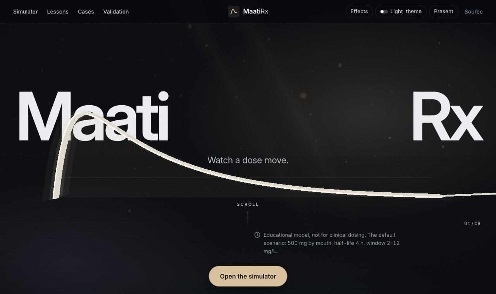

Since 2.0 the curve also lives as a 3D ribbon on a stage behind the page, drawn live from the same numbers as the chart: glowing in the dark simulator, graphite on the paper pages for lessons, cases and practice. A first visit opens on a short scrolling introduction; any shared link goes straight to what it names. **Effects** in the top bar turns the 3D stage off, and it starts off on low-memory devices and with reduced motion.

| A lesson, on paper | 200 virtual patients around their median |
| --- | --- |
| 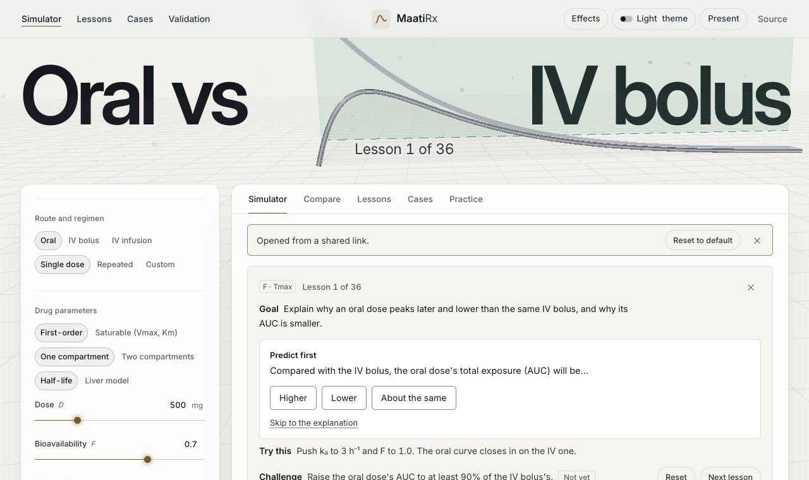 | 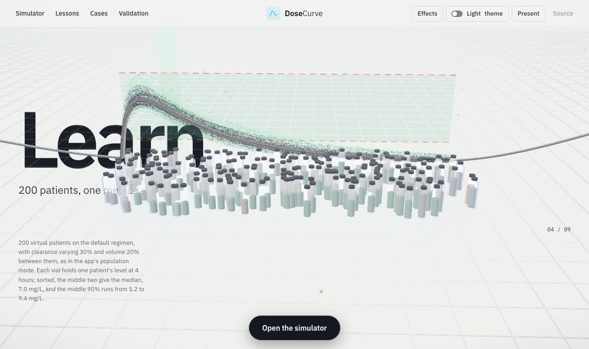 |

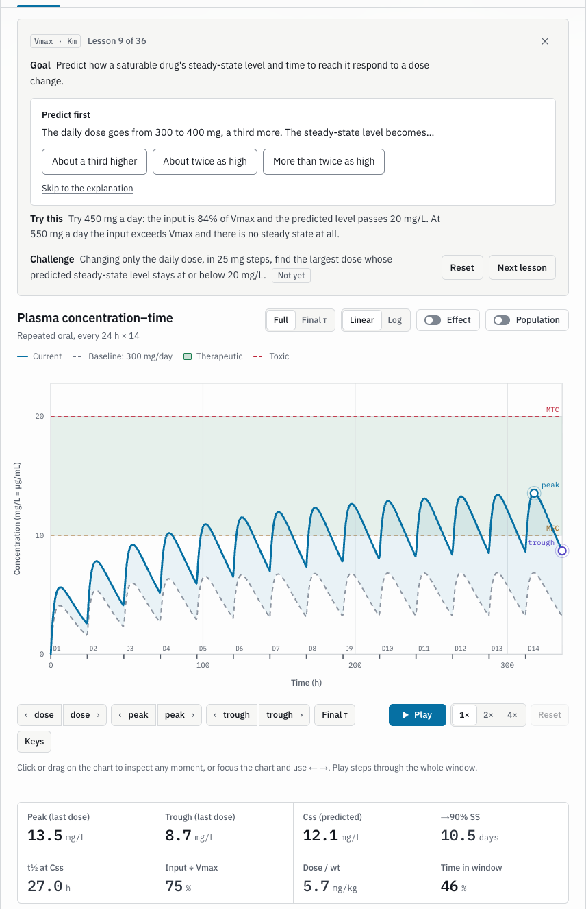

## What it does

**Simulate**
- Oral, IV bolus and IV infusion dosing: single, repeated (with loading and missed doses), or a custom schedule where every dose has its own time, amount and route. Drag a dose along the timeline to reschedule it.
- **One or two compartments.** With two, the drug enters a central volume and exchanges with a peripheral one (k12, k21), so the curve falls in a fast distribution phase and a slower terminal phase, C(t) = A·e^(−αt) + B·e^(−βt). The readouts give α, β, the steady-state volume and the terminal half-life, and the vancomycin case compares its regimen under both models.
- First-order elimination, or saturable **Michaelis–Menten** elimination (Vmax, Km) integrated numerically. The readouts give the predicted steady state Km·R / (Vmax − R), the input as a share of Vmax, the level-dependent half-life and the time to 90% of steady state, and they say "No steady state: input rate exceeds Vmax" when that happens.
- A **liver model** (optional): hepatic clearance and first-pass bioavailability from liver blood flow, the unbound fraction and intrinsic clearance (the well-stirred model), E = fu·CLint / (Q + fu·CLint), CL = Q·E and F = fabs·(1 − E), with the working shown.
- **Individualize from levels** (Bayesian, in Clinical mode): measured levels, each tied to a dose, weighed against the patient model (maximum a posteriori, the approach of Sheiner et al. 1979), give the patient's own clearance, volume and half-life with 95% intervals, how much uncertainty the levels removed, the two-level estimate beside it, and the dose for an AUC24 or trough target.
- **Hemodialysis:** sessions (their clearance, length and timing) add the dialyzer's clearance while they run. A table gives each session's level before and after, the amount removed and the IV dose that would restore the level. The readouts show the clearance on and off dialysis and the fall per session. With two compartments the level rebounds after each session as drug returns from the tissues, and the table gives the rebound's height and timing; the solution stays exact between events.
- A **clinical patient**: age, sex, height, weight and serum creatinine give ideal and adjusted body weight (Devine), Cockcroft–Gault creatinine clearance, and the drug's clearance CL = CL_ref × [(1 − fe) + fe × CrCl / 120], with every step shown with its numbers.
- A **drug library** of 12 teaching profiles (gentamicin, vancomycin, meropenem, piperacillin-tazobactam, digoxin, phenytoin, theophylline, lithium carbonate, levetiracetam and three more). Every value names its source (the FDA label on DailyMed, or a paper) or is marked "typical textbook value, unverified". Units follow the drug: digoxin in mcg and ng/mL, lithium in mEq/L, with salt factors applied.
- The **effect** (PK/PD): a sigmoid Emax model, its concentration–effect curve, and time above a target effect. An optional effect-site delay (an equilibration half-life) makes the effect lag the level: the effect-site level is drawn under the plasma curve, and the concentration–effect chart shows the hysteresis loop. **Indirect responses** (the four types of Dayneka, Garg and Jusko, 1993): the drug inhibits or stimulates the production or loss of something the body makes, and the response, as a percentage of its baseline, follows that turnover, with a lag set by its half-life.
- **Antimicrobial PK/PD:** enter the organism's MIC (and the drug's unbound fraction) to read fT>MIC on the unbound level, Cmax/MIC and AUC24/MIC at steady state, with the MIC line and the unbound level drawn on the chart. Each antimicrobial in the library names the index its label or guideline gives; a numeric target appears only where a cited source states one (vancomycin's AUC24/MIC of 400–600).
- A **population**: 50–1,000 virtual patients with log-normal variability on clearance (or Vmax, for a saturable drug) and volume, drawn as a 5th–95th percentile band. With saturable elimination it also reports the share whose input exceeds their own Vmax, so they never reach a steady state. It reports the probability of target attainment at steady state (and for an AUC24 range), is computed in a Web Worker, and reproduces from its seed. With the effect charts on, the effect (direct, delayed or an indirect response) gets the same patients' band, and the panel compares the spread in effect with the spread in level that drives it.

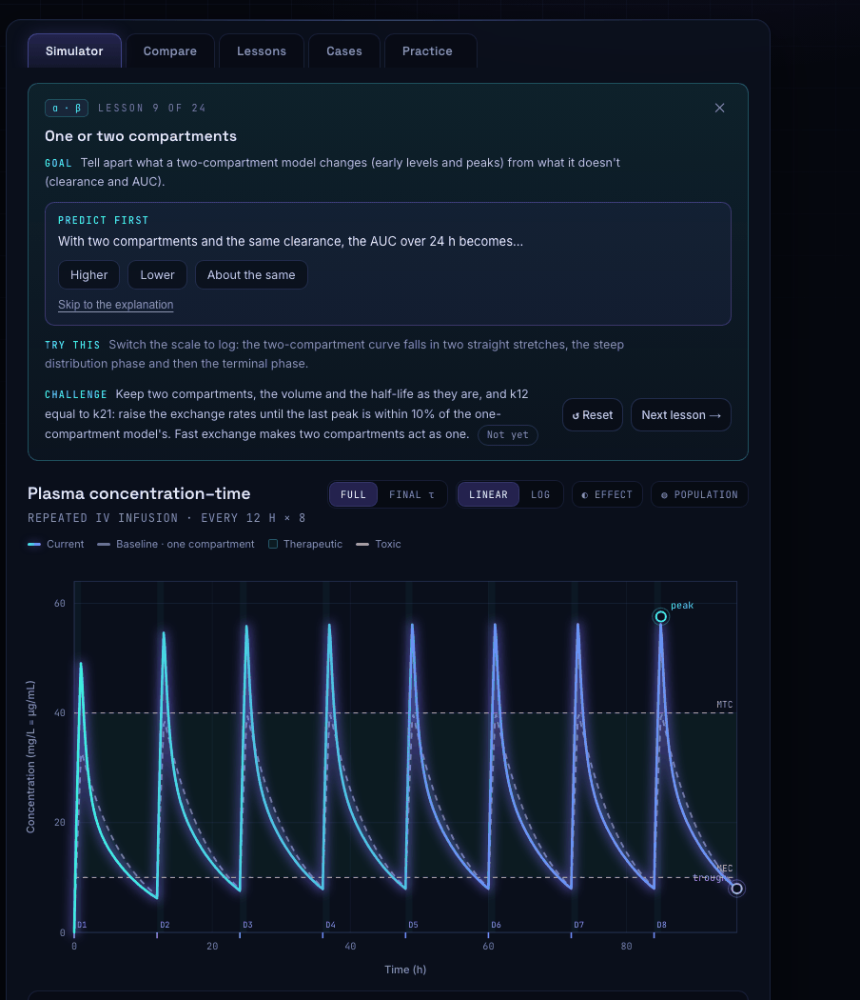

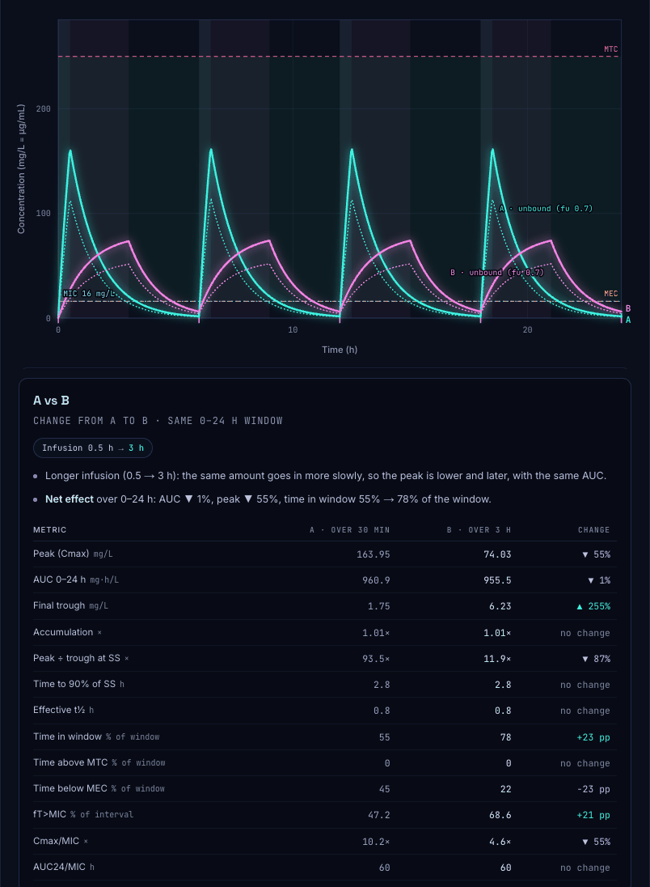

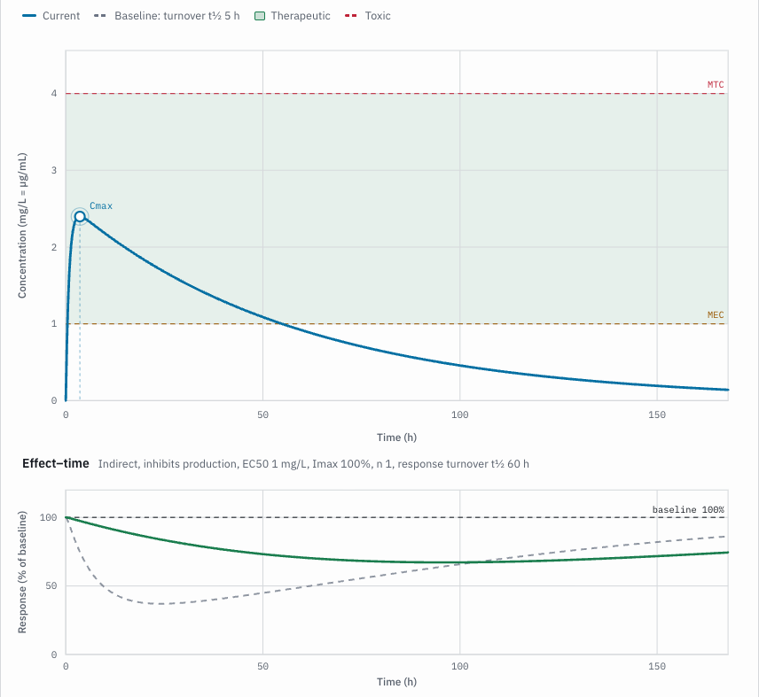

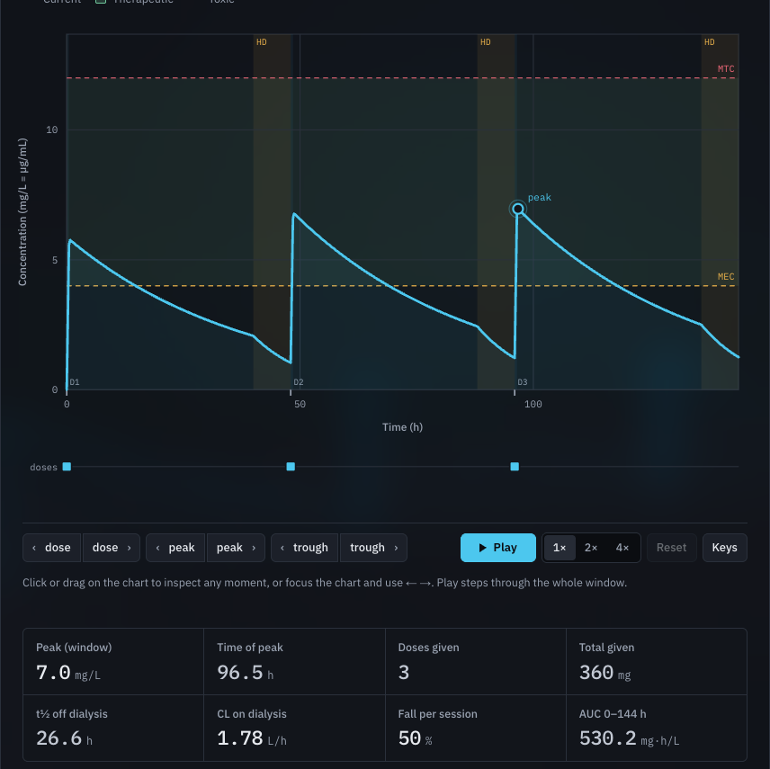

**Explain**
- Set a baseline, change anything, and **What changed** explains it with the model's numbers: "CrCl fell from 73 to 41 mL/min, so the clearance of a drug that is 90% renally excreted fell 38%; the half-life rose from 3.9 h to 6.2 h; the steady-state trough rose from 2.2 to 4.7 mg/L."
- Compare scenarios A and B side by side, with "Vary only" to change one thing at a time, and 28 one-click comparisons.
- Select any readout to see its formula worked through with the scenario's own numbers.
- **Sensitivity:** move each input (clearance, volume, F, kₐ, dose, interval; k12 and k21 with two compartments) 20% down and up, one at a time, and see a tornado chart of the change in AUC24, the peak, the trough or the time in the window, with a sentence naming the input that matters most.
- **When to sample:** for a repeated regimen, the dose from which its peak and trough are within 10% of steady state, and the model's peak and trough times in that interval (with two compartments, once distribution is 90% complete), each with a button that moves the time cursor there.

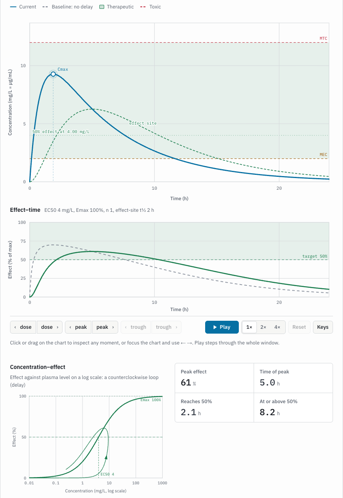

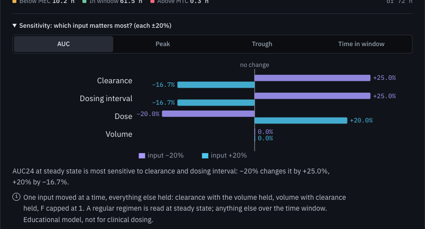

**Teach and practise**
- **36 guided lessons** that ask for a prediction first and end with a challenge the app checks live.
- **16 clinical cases** (gentamicin conventional, once daily, on hemodialysis, individualized from two levels and from a Bayesian estimate, vancomycin to an AUC24 target, from two measured levels and from a Bayesian estimate, meropenem, piperacillin-tazobactam and levetiracetam by their labels' renal tables, phenytoin with low albumin, digoxin, theophylline in a smoker, lithium, a late-dose question), one of them the case of the day, the same for everyone on a given date. The model grades a proposed regimen at steady state, gives rule-based hints, re-grades it rounded to the forms available, and walks through the textbook route.
- **42 kinds of generated practice problems** in seven topics with worked solutions, printable worksheets with answer keys, "Fit the data" (including a two-compartment curve to strip by the method of residuals) and "Hit the window" exercises, and a 69-term glossary.
- **For instructors:** write a case (patient, drug, regimen choices and target) and share it as a link, checked for a solution before the link is made and marked as an unreviewed community case; put cases and worksheets in one assignment link; and verify the completion codes (HMAC-SHA256 with a class key) students make at the end. Nothing is sent anywhere.
- Links for everything (a scenario, a lesson, a problem, a worksheet, a case, an assignment), embed code for course pages, a light theme for projectors, printable handouts, and offline use after one visit.

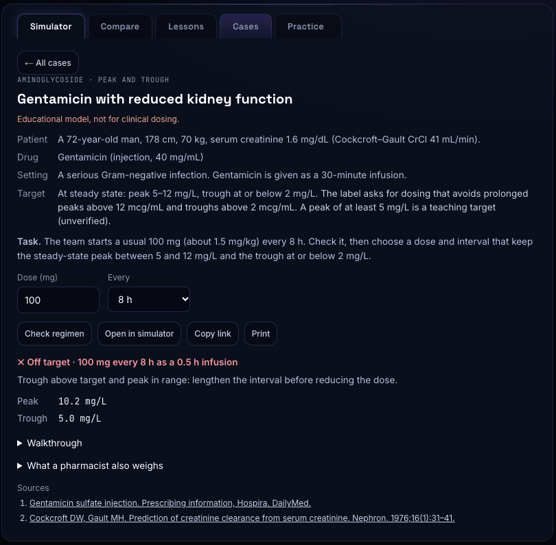

## Validation

An independent solver, [`validation/reference.py`](validation/reference.py), integrates the model's equations with SciPy's `solve_ivp`. It runs 146 scenarios:

- **Routes:** oral, IV bolus, IV infusion, and mixed routes.
- **Regimens:** single, repeated, loading, missed and custom.
- **Drugs:** first-order, first-order with a salt factor, saturable, and two-compartment.
- **Patients:** normal, and reduced creatinine clearance.
- **Effect site:** 20 first-order scenarios with an effect-site delay, read at the effect site.

The test suite and the [validation page](https://saifmaati.github.io/dose-curve/validation.html) compare DoseCurve's peak, trough, AUC and time in window with it. All 584 comparisons agree within 0.5% for first-order scenarios and 1% for saturable ones. The largest difference is 0.00002% (two parts in ten million), and 0.000001 percentage points in time in window. Analytic identities are tested too:

- the accumulation ratio
- 3.32 half-lives to 90% of steady state
- AUC = F·S·D / CL
- the infusion plateau
- the Michaelis–Menten steady state and its time to 90%
- the Cockcroft–Gault and Devine hand values

It also checks the Bayesian estimates: on 20 scenarios with one to three measured levels, an independent SciPy implementation of the same objective agrees on clearance and volume within 0.5% (in practice to within 0.00003%).

And the antimicrobial indices: 12 regimens (piperacillin by 30-minute, extended and continuous infusion, and with reduced kidney function; meropenem; gentamicin divided and once daily; vancomycin; oral; IV bolus; two compartments) run to steady state in the ODE solver. fT>MIC agrees within 0.01 percentage points and Cmax/MIC and AUC24/MIC within 0.01% (in practice to about one part in a billion). The tests also hold fT>MIC to its closed forms: ln(C₀,ss / (MIC/fu)) / kₑ for an IV bolus, both crossings of an infusion, and exactly 100% for a continuous infusion above the MIC.

And the indirect responses: 12 scenarios across the four types (every route, a custom schedule, two compartments, saturable elimination, a reduced-CrCl patient) integrate the response with the drug in one ODE system. The response agrees within 0.01% at five times and at its largest change (in practice to about one part in 10⁸), and the time of that change within 0.01 h. The tests also check that it stays at baseline without drug, and that at a constant level it approaches the analytic plateau with time constant 1/kout.

And hemodialysis: 11 scenarios (3 with two compartments, where the level rebounds) with the dialysis clearance switched on during each session. The level, and each session's levels and the amount it removes, agree within 0.01% (in practice to about one part in 10¹²). The tests also hold the model to mass balance: what the body clears plus what the dialyzer removes is what was given.

A standing cross-check runs in the test suite too. Seeded random scenarios cover routes, loading and missed doses, one and two compartments, custom schedules and saturable elimination. Every peak and trough in the dose table, the last-dose and steady-state peaks, the window's area and times, and the time above a target effect (with and without an effect-site delay) are compared with dense scans of the engine's own curve. It has found and fixed four errors so far, each now with its own regression test:

- the dose table's peaks off by one dose for IV boluses
- sampled peaks up to 3.7% low
- a bolus at the window's end counted inside it
- effect times up to 0.12 h off

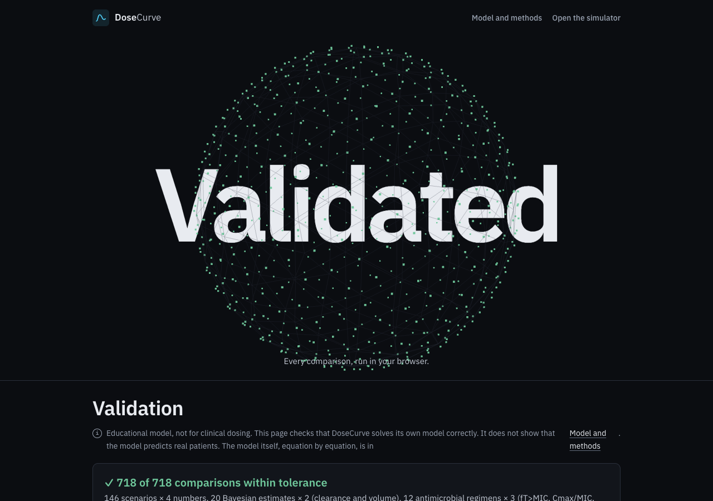

## Quick start

It's a static site with no build step and no dependencies. Open `index.html`, or serve the folder:

```bash
python3 -m http.server 8000
```

Tests (Node 20; nothing to install):

```bash
node --test tests/
```

Regenerate the reference results (optional):

```bash
python3 -m pip install numpy scipy
python3 validation/reference.py
```

When `pk-engine.js` or one of the files loaded on demand (`cases.js`, `pk-math.js`, `pk-glossary.js`, `pk-practice.js`, `pk-lessons.js`, `pk-bayes.js`, `pk-idr.js`, `pk-hd.js`, `pk-sens.js`, `pk-tdm.js`, `pk-explain.js`, `pk-sources.js`, `pop-worker.js`) changes, update its `?v=` content-hash stamp where it's loaded: `index.html` and `validation.html` for the engine, `index.html` and `sw.js` for the others. The failing test prints the new value.

## How it's built

| File | Purpose |
| --- | --- |
| `index.html` | The app: UI, charts, lessons, practice |
| `pk-engine.js` | The model, with no DOM access, so it runs in the browser and in Node. It holds the PK equations (closed-form sums of exponentials; RK4 for saturable elimination), the clinical patient, units, the drug library, the antimicrobial indices, each lesson's scenarios and the share-link format |
| `cases.js` | The clinical cases and their grader, loaded when the Cases tab opens |
| `pk-math.js` | The worked formulas behind each readout, loaded the first time one is opened |
| `pk-glossary.js` | The glossary, loaded with the Lessons tab |
| `pk-practice.js` | The generated practice problems and worksheets, loaded with the Practice tab |
| `pk-lessons.js` | The lessons' texts, predictions and challenges, loaded with the Lessons tab or a lesson link |
| `pk-bayes.js` | The Bayesian (MAP) estimate from measured levels, loaded when levels are entered and with the cases |
| `pk-idr.js` | The indirect response models, loaded when a scenario uses one |
| `pk-sens.js` | The sensitivity analysis and its tornado chart, loaded when its panel opens |
| `pk-tdm.js` | When to sample: the model's steady-state, peak and trough times for a repeated regimen, loaded when its section opens |
| `pk-explain.js` | The sentences under "What changed" and in Compare, loaded just after the first paint |
| `pk-hd.js` | Hemodialysis sessions (exact between each dose, infusion end and session edge, with one or two compartments), loaded when a scenario has dialysis on |
| `pk-sources.js` | Where each library value comes from, loaded with the drug information, the antimicrobial panel and the cases |
| `pop-worker.js` | Population mode, run as a Web Worker |
| `stage.js` | The 3D stage and the opening sequence (since 2.0), loaded after the first paint; with Effects on it imports Three.js, pinned to one cdnjs release and checked by hash |
| `fonts/` | IBM Plex Sans and Mono, served from the site |
| `tools/stamp.js` | Restamps the content hashes of the files loaded on demand (`node tools/stamp.js`) |
| `validation.html`, `validation/` | The public validation page, the independent reference solver and its results |
| `educators.html` | The page for instructors: what DoseCurve covers, how to run a class, and a link to every lesson and case |
| `sw.js` | The service worker for offline use |
| `tests/` | The engine, clinical, saturable, two-compartment, cases, population, validation, accessibility, release and service-worker tests |
| `docs/` | The teaching guide, [ARCHITECTURE.md](docs/ARCHITECTURE.md) (how the pieces fit), [DESIGN.md](docs/DESIGN.md) (the design system and storyboards), audits, build logs, decisions and reports |

Share links carry every setting in the URL itself and are written at the lowest format version that holds them (v1–v11). Older links open unchanged, and a scenario link without a version reads as v1. Nothing is sent to or stored on a server; saved scenarios and progress stay in your browser. Visit counting (GoatCounter, cookie-free) is off unless the site owner sets `ANALYTICS_SITE_ID`, and it never receives a link's settings. Don't enter patient-identifying information.

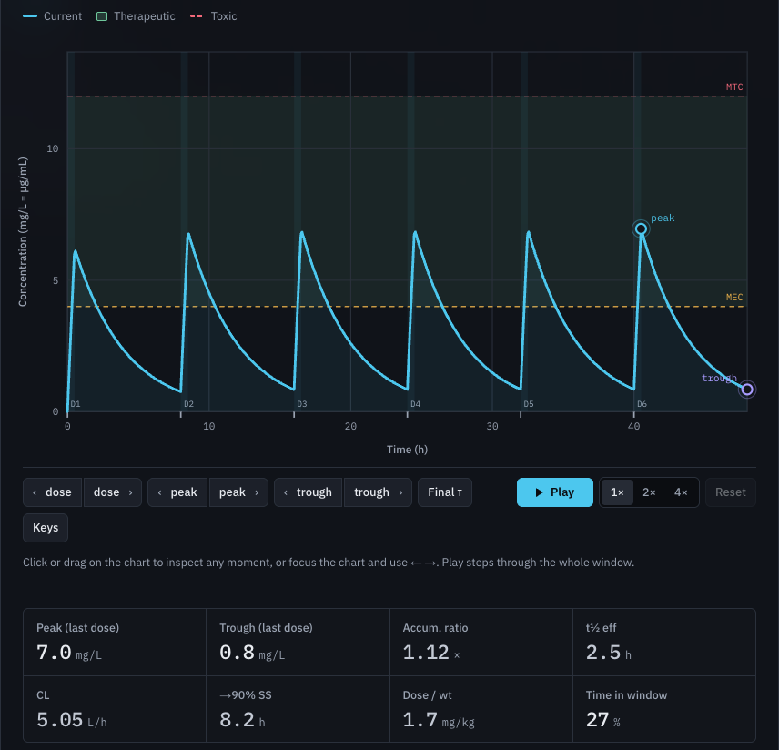

## How to cite

See [`CITATION.cff`](CITATION.cff) (GitHub's "Cite this repository" button uses it):

> Maati S. DoseCurve: an interactive pharmacokinetics and PK/PD simulator for pharmacy education. Version 2.8.0. 2026. https://github.com/Saifmaati/dose-curve

## Contributing

Issues and suggestions are welcome, and there are templates for a [bug report](https://github.com/Saifmaati/dose-curve/issues/new?template=bug_report.md), [feedback](https://github.com/Saifmaati/dose-curve/issues/new?template=feedback.md), and ["I'm an educator and want…"](https://github.com/Saifmaati/dose-curve/issues/new?template=educator.md).

For changes:
- Keep the site static (no build step; the one runtime dependency is Three.js for the optional 3D stage, pinned and loaded from cdnjs), keep every number the UI shows covered by a test, and run `node --test tests/` before sending.
- The full checklist is in [CONTRIBUTING.md](CONTRIBUTING.md).
- Cite drug values only from a source you've read (an FDA label on DailyMed or a paper), or mark them unverified.

See [CHANGELOG.md](CHANGELOG.md) for what changed in each release.

## License

[MIT](LICENSE) © 2026 Saif Maati
